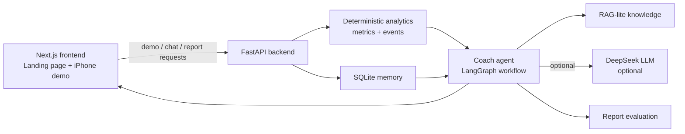

# DriveCoach AI

**Human-Centred AI Driving Coach** is a route-aware post-drive AI coaching prototype. It turns connected-vehicle telemetry into deterministic driving behaviour metrics, risk-event evidence, and practical coaching guidance.

The project explores a human-centred question: can driving performance be quantified from vehicle behaviour and optional driver-state signals, then explained in a way that helps a driver or evaluator improve the next session?

## Product Snapshot

DriveCoach AI is not a real-time in-car warning system, not an insurance score, and not a medical assessment tool. It is a post-drive review product for connected-vehicle analytics, ADAS evaluation, and evidence-grounded AI coaching.

Current demo flow:

```text
Regenerate Sample Trip
-> Generate route-grounded Cranfield to Milton Keynes session
-> Calculate deterministic metrics
-> Detect context-aware risk events
-> Run AI coach workflow
-> Show summary, drive data, coach report, and history
```

## Highlights

- Next.js / React / TypeScript product demo with an iPhone-style post-drive review surface
- FastAPI backend for demo session generation, analysis, coach report, coach chat, memory, and evaluation
- Route-grounded synthetic driving sessions for Cranfield University to Milton Keynes Midsummer Place
- Deterministic metrics for smoothness, lateral stability, context adaptation, and event burden
- Context-aware risk-event detection using route segment, target speed, curvature, traffic complexity, and vehicle signals
- LangGraph-ready coach workflow with validation and deterministic revision
- Optional DeepSeek LLM integration with deterministic fallback when no API key is configured
- RAG-lite local knowledge base with explainable retrieval metadata
- SQLite session memory for previous-drive comparison, score trend, and target completion
- Agent evaluation for evidence use, route relevance, suggestion specificity, measurability, and overclaim control
- Backend ingestion contract for telemetry JSON, CSV path, and route simulation

## Tech Stack

| Layer | Technology |
| --- | --- |
| Frontend | Next.js, React, TypeScript, Tailwind CSS, Recharts |
| Backend | Python, FastAPI, Pydantic-style schemas |
| Analytics | Deterministic metrics, rule-based event detection, route-context thresholds |
| Agent workflow | LangGraph-compatible Python workflow |
| LLM | DeepSeek through OpenAI-compatible SDK, optional |
| Knowledge | File-based RAG-lite Markdown snippets |
| Memory | SQLite |
| Testing | pytest, TypeScript typecheck, ESLint, Next.js build |

## Architecture



Core principle:

> Metrics and risk events are calculated deterministically. The AI coach explains the evidence and turns it into practical guidance.

## Repository Structure

```text
backend/
  agent/           Coach workflow, DeepSeek client, RAG-lite retrieval
  evaluation/      Report, knowledge, and trace evaluation
  ingestion/       Telemetry JSON, CSV path, and route simulation ingestion
  knowledge/       Local RAG-lite knowledge snippets
  services/        Demo session, memory, targets, coaching services
src/
  app/             Next.js app shell
  components/      Phone demo, tabs, charts, cards
  lib/             Frontend API client, fallback generator, metrics
  types/           Shared TypeScript driving types
docs/
  PRD.md
  TECHNICAL_DESIGN.md
  AGENT_WORKFLOW_DESIGN.md
  METRICS_AND_EVALUATION.md
tests/
  pytest backend/API tests
```

## Documentation

Start here:

- [Documentation Index](docs/README.md)
- [Product Requirements Document](docs/PRD.md)
- [Technical Design](docs/TECHNICAL_DESIGN.md)
- [Agent Workflow Design](docs/AGENT_WORKFLOW_DESIGN.md)
- [Metrics and Evaluation](docs/METRICS_AND_EVALUATION.md)

## Local Setup

### 1. Install Python dependencies

```bash
python -m venv .venv
.venv\Scripts\activate
pip install -r requirements.txt
```

### 2. Install frontend dependencies

```bash
npm install
```

### 3. Optional LLM configuration

The app works without an API key. If no key is configured, the backend uses deterministic fallback reports.

Create `.env` from `.env.example` and add your own key locally:

```powershell
DEEPSEEK_API_KEY=your-key-here
DEEPSEEK_BASE_URL=https://api.deepseek.com
DEEPSEEK_MODEL=deepseek-v4-flash
```

Do not commit `.env`. It is ignored by git.

## Run Locally

Start the backend:

```bash
uvicorn backend.main:app --reload --host 127.0.0.1 --port 8000
```

Start the frontend in another terminal:

```bash
npm run dev -- --hostname 127.0.0.1 --port 3000
```

Open:

```text
http://127.0.0.1:3000
```

## Key API Endpoints

```text
GET  /health
GET  /api/scenarios
POST /api/demo-session
POST /api/analyse-session
POST /api/coach-report
POST /api/coach-chat
POST /api/coaching-targets
POST /api/target-completion
POST /api/memory-aware-coaching
GET  /api/knowledge/evaluation
GET  /api/agent-traces/recent
GET  /api/session-memory/recent
POST /api/session-memory/save
POST /api/session-memory/compare
```

## Verification

```bash
python -m pytest
npm run typecheck
npm run lint
npm run build
```

## Data and AI Safety Boundaries

- Current route sessions are route-grounded synthetic data, not real driver data.
- Vehicle telemetry is the core analysis source.
- Wearable / heart-rate data is optional context only.
- The product does not diagnose stress, fatigue, health, or medical state.
- The AI coach does not create metrics or risk events.
- Thresholds are transparent coaching heuristics, not universal safety limits.
- Local `.env`, SQLite databases, logs, build folders, and dependencies are ignored by git.

## Roadmap

- Phase A: GitHub-ready README, documentation index, project presentation polish
- Frontend documentation centre inside the demo page
- English / Chinese UI and documentation split
- More rigorous RAG knowledge schema and retrieval explainability
- Real route fetching with OSRM / OSMnx
- Real or simulator telemetry ingestion with calibration dataset support
- ADAS-on vs ADAS-off comparison workflow
- CI for frontend, backend, knowledge evaluation, and agent report quality

## Status

This repository is an interactive local MVP and portfolio-grade prototype. It is designed to demonstrate product thinking, deterministic analysis, and evidence-grounded AI coaching before production deployment.

