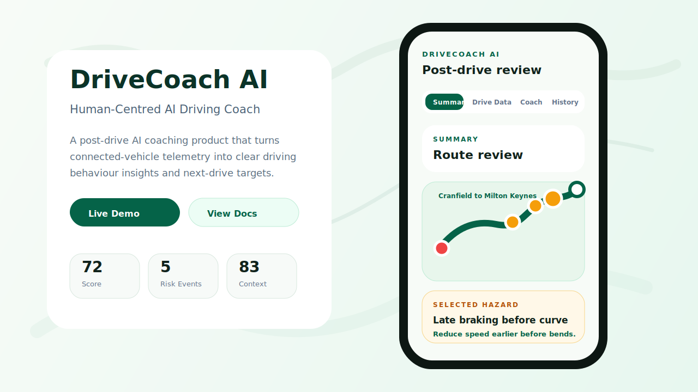
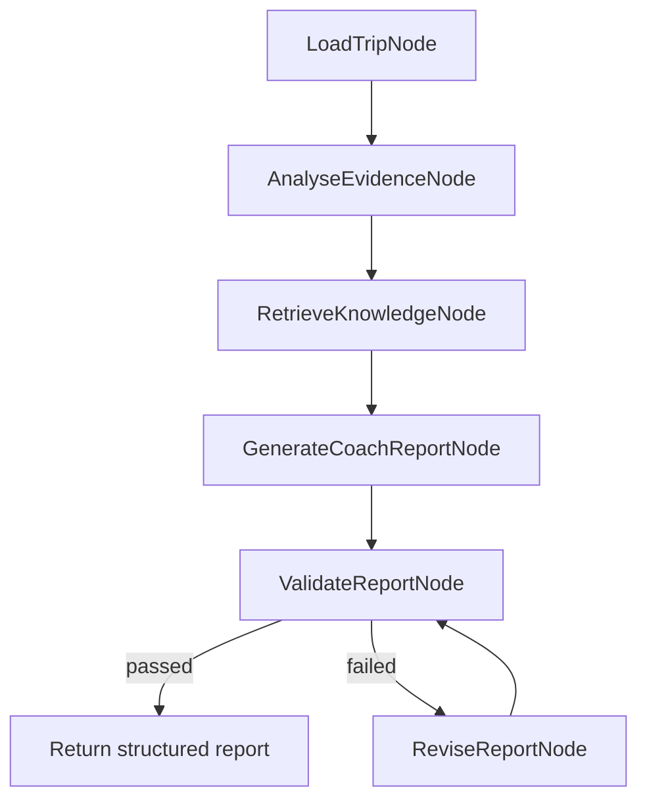

# DriveCoach AI

**Human-Centred AI Driving Coach** is a route-aware post-drive AI coaching product that turns connected-vehicle telemetry into evidence-grounded driving behaviour insights, Risk Event explanations, and measurable next-drive coaching targets.

[Live Demo](#live-demo) | [Screenshots](#screenshots) | [English Docs](docs/en/README.md) | [中文文档](docs/zh/README.md)

> The public demo runs without private API keys and uses deterministic fallback coaching. For the full local LLM experience, configure `DEEPSEEK_API_KEY` in `.env`.

## Live Demo

Public frontend demo URL: **coming soon after Vercel deployment**.

The public demo is designed to be API-key-free. It will run the same product UI using deterministic sample trips and fallback coaching logic, so reviewers can open the interface without setting up DeepSeek, FastAPI, or local environment variables.

For local full-agent mode, run the FastAPI backend and configure `DEEPSEEK_API_KEY` as described in [API Key & Security](#api-key--security).

## Screenshots



This preview represents the current product direction: a clean landing page, route-aware iPhone-style post-drive review, Risk Event markers, and an AI coaching layer. A real app screenshot or GIF can replace this asset after public deployment.

## What It Does

DriveCoach AI demonstrates a complete post-drive coaching loop:

```text
Regenerate Sample Trip
-> Generate route-grounded Cranfield to Milton Keynes session
-> Calculate deterministic metrics
-> Detect context-aware Risk Events
-> Run AI coach workflow
-> Show Summary, Drive Data, Coach, and History
-> Compare the next session with previous targets
```

Core product capabilities:

- Route-aware trip review from Cranfield University to Milton Keynes Midsummer Place
- Deterministic driving metrics for smoothness, lateral stability, context adaptation, and event burden
- Context-aware Risk Event detection using route segment, target speed, curvature, traffic complexity, and vehicle signals
- AI Coach summary grounded in metrics, events, route context, and retrieved knowledge
- Ask DriveCoach follow-up chat with evidence-used display
- SQLite session memory for score trend, previous-drive comparison, and target completion
- Optional wearable context, treated only as driver-state context and never as a medical diagnosis

## Agent Workflow

The AI coach is implemented as a workflow, not a single prompt. Metrics and Risk Events are calculated before the agent writes any natural language.



Agent capabilities:

- LangGraph-ready conditional workflow
- DeepSeek integration through an OpenAI-compatible client
- deterministic fallback when no API key is configured
- RAG-lite local knowledge retrieval with explainable metadata
- report validation and one revision pass
- compact agent traces and quality evaluation

## Evidence-First Design

DriveCoach AI separates evidence, interpretation, and coaching:

| Layer | Responsibility |
| --- | --- |
| Deterministic analytics | Calculate metrics, thresholds, and Risk Events |
| Route context | Explain whether the event happened on campus, rural road, curve, junction, or urban arrival |
| RAG-lite knowledge | Add bounded coaching guidance and policy reminders |
| AI coach | Explain evidence and turn it into practical next-drive guidance |
| Evaluation | Check specificity, measurability, route relevance, evidence use, and overclaim control |

Boundaries:

- The AI coach does not create metrics or Risk Events.
- Current route sessions are route-grounded synthetic data, not real driver data.
- Thresholds are transparent coaching heuristics, not universal safety limits.
- Wearable / heart-rate data is optional context only.
- The product does not diagnose stress, fatigue, health, or medical state.

## Quickstart

### 1. Install Python dependencies

```bash
python -m venv .venv
.venv\Scripts\activate
pip install -r requirements.txt
```

### 2. Install frontend dependencies

```bash
npm install
```

### 3. Start the backend

```bash
uvicorn backend.main:app --reload --host 127.0.0.1 --port 8000
```

### 4. Start the frontend

```bash
npm run dev -- --hostname 127.0.0.1 --port 3000
```

Open:

```text
http://127.0.0.1:3000
```

The app still works without the backend because the frontend includes deterministic fallback sample trips and fallback coaching.

## API Key & Security

The public demo must not expose private API keys.

Recommended setup:

- Public hosted frontend: no private key, deterministic fallback coaching.
- Local full-agent demo: configure `DEEPSEEK_API_KEY` in `.env`.
- Hosted backend later: store `DEEPSEEK_API_KEY` only in the deployment platform's environment variables or secrets.

Example local `.env`:

```powershell
DEEPSEEK_API_KEY=your-key-here
DEEPSEEK_BASE_URL=https://api.deepseek.com
DEEPSEEK_MODEL=deepseek-v4-flash
```

Never commit `.env`, API keys, SQLite databases, logs, or generated secrets.

## Documentation

| Document | English | 中文 |
| --- | --- | --- |
| Documentation index | [docs/en/README.md](docs/en/README.md) | [docs/zh/README.md](docs/zh/README.md) |
| Product Requirements | [PRD](docs/en/PRD.md) | [PRD 中文](docs/zh/PRD.md) |
| Technical Design | [Technical Design](docs/en/TECHNICAL_DESIGN.md) | [技术设计](docs/zh/TECHNICAL_DESIGN.md) |
| Agent Workflow | [Agent Workflow Design](docs/en/AGENT_WORKFLOW_DESIGN.md) | [Agent 工作流设计](docs/zh/AGENT_WORKFLOW_DESIGN.md) |
| Metrics & Evaluation | [Metrics and Evaluation](docs/en/METRICS_AND_EVALUATION.md) | [指标与评估](docs/zh/METRICS_AND_EVALUATION.md) |

## Tech Stack

| Layer | Technology |
| --- | --- |
| Frontend | Next.js, React, TypeScript, Tailwind CSS, Recharts |
| Backend | Python, FastAPI |
| Analytics | Deterministic metrics, route-context thresholds, rule-based event detection |
| Agent workflow | LangGraph-compatible Python workflow |
| LLM | DeepSeek through OpenAI-compatible SDK, optional |
| Knowledge | File-based RAG-lite Markdown snippets |
| Memory | SQLite |
| Testing | pytest, TypeScript typecheck, ESLint, Next.js build |

## Verification

```bash
python -m pytest
npm run typecheck
npm run lint
npm run build
```

## Roadmap

- Public frontend demo deployment with deterministic fallback
- Replace preview SVG with real screenshot / GIF after deployment
- Pass `locale` to backend Agent endpoints for fully bilingual LLM output
- More rigorous RAG knowledge schema and retrieval explainability
- Real route fetching with OSRM / OSMnx
- Real or simulator telemetry ingestion with calibration dataset support
- ADAS-on vs ADAS-off comparison workflow
- CI for frontend, backend, knowledge evaluation, and agent report quality

## Status

This repository is an interactive local MVP and portfolio-grade prototype. It is designed to demonstrate product thinking, deterministic analysis, and evidence-grounded AI coaching before production deployment.
