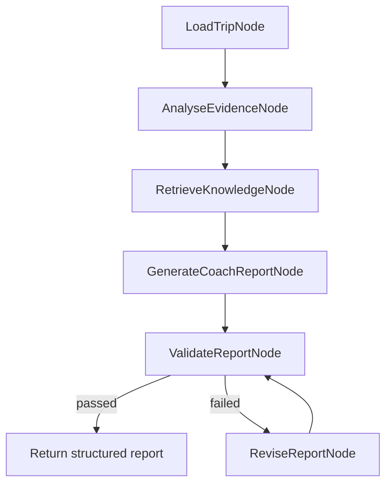

# Agent Workflow Design

## Purpose

This document describes the DriveCoach AI agent workflow. The agent exists to turn deterministic driving evidence into clear coaching guidance. It does not calculate primary driving metrics and does not invent risk events.

The workflow is intentionally lightweight:

- deterministic metrics first
- route-aware risk events first
- RAG-lite knowledge retrieval before report generation
- LLM generation when configured
- deterministic fallback when no API key or runtime error exists
- validation and one deterministic revision pass
- compact trace recording

## Agent Boundary

### The agent may do

- summarise a completed trip
- explain evidence in natural language
- connect event types to route context
- retrieve local coaching guidance snippets
- generate practical next-drive suggestions
- answer follow-up questions using trip evidence
- produce a structured report response

### The agent must not do

- create or alter deterministic driving metrics
- create or alter risk events
- diagnose stress, fatigue, health, or medical state
- claim that a synthetic route session is real driver data
- hide unsupported LLM output behind the UI
- produce coaching targets without measurable criteria

## Core State

The workflow uses a `CoachAgentState` shape in the backend. Conceptually it contains:

```text
trip
route_context
metrics
events
evidence_summary
guidance_context
retrieved_knowledge
report
report_validation
revision_count
workflow_engine
workflow_nodes
mode
```

This state keeps the agent extensible. Future nodes can add vector retrieval, tool calls, batch comparison, or user profile memory without changing the frontend response contract.

## Report Workflow



## Node Responsibilities

| Node | Responsibility | Output |
| --- | --- | --- |
| `LoadTripNode` | Extract route, metrics, and events from `SampleTrip` | `route_context`, `metrics`, `events` |
| `AnalyseEvidenceNode` | Summarise event types, severity counts, wearable state, and priority event | `evidence_summary` |
| `RetrieveKnowledgeNode` | Select RAG-lite knowledge snippets by event type, route context, metrics, and user question keywords | `guidance_context`, `retrieved_knowledge` |
| `GenerateCoachReportNode` | Generate the structured coach report using DeepSeek when available or deterministic fallback otherwise | `report` |
| `ValidateReportNode` | Check required fields and unsafe language | `report_validation`, `validation_notes` |
| `ReviseReportNode` | Repair missing fields, restore evidence, restore retrieved knowledge, and sanitise unsupported language | revised `report` |

## Workflow Engines

The backend supports two execution modes:

| Engine | Use |
| --- | --- |
| `langgraph` | Preferred when LangGraph is installed |
| `python_node_runner` | Deterministic fallback with the same node order |

Both modes return the same frontend-compatible report shape.

## LLM Generation

When `DEEPSEEK_API_KEY` is configured, `GenerateCoachReportNode` calls the DeepSeek-compatible OpenAI SDK.

Expected model:

```text
deepseek-v4-flash
```

The LLM receives deterministic trip evidence and should return a structured report. If the call fails or returns unusable output, the backend falls back to deterministic report generation.

## Deterministic Fallback

Fallback report generation uses:

- route name
- origin and destination
- driving score
- context adaptation score
- event types
- priority event
- wearable connection status
- retrieved knowledge summary
- event-specific suggestions

This makes the demo API-key-free and keeps the product stable during local development.

## Structured Report Contract

The coach report should include:

```json
{
  "summary": "...",
  "structuredSummary": {
    "overallAssessment": "...",
    "mainBehaviouralPattern": "...",
    "routeContextExplanation": "...",
    "whyItMatters": "...",
    "nextDriveFocus": []
  },
  "keyFindings": [],
  "behaviourInsight": "...",
  "driverStateInsight": "...",
  "nextSessionFocus": [],
  "eventSuggestions": [],
  "evidenceUsed": [],
  "retrievedKnowledge": [],
  "agentMode": "...",
  "workflowEngine": "...",
  "workflowNodes": []
}
```

The frontend uses only a subset by default:

- summary
- key evidence
- main focus
- next drive target
- Ask DriveCoach chat

Technical fields remain available in the collapsed Evidence & trust area.

## RAG-lite Retrieval

The current knowledge layer is file-based. Markdown knowledge files live under:

```text
backend/knowledge/
```

Each snippet includes metadata such as:

```text
id
title
eventTypes
keywords
source
confidence
version
appliesTo
doSay
doNotSay
body
```

Retrieval is explainable and returns:

```json
{
  "id": "cornering_stability",
  "title": "Cornering stability and entry speed",
  "source": "https://www.gov.uk/...",
  "confidence": "high",
  "matchedBy": ["event_type:high_lateral_acceleration"],
  "whyUsed": "Selected because it matches detected event type(s).",
  "retrievalMode": "rag_lite_explainable"
}
```

## Coach Chat Workflow

Coach chat is exposed through:

```text
POST /api/coach-chat
```

Input:

```json
{
  "trip": {},
  "messages": [
    { "role": "user", "content": "Why was this event risky?" }
  ],
  "selectedEvent": {}
}
```

Output:

```json
{
  "answer": "...",
  "evidenceUsed": [],
  "coachingActions": [],
  "confidence": "medium",
  "safetyNotes": [],
  "followUpQuestions": [],
  "retrievedKnowledge": []
}
```

The chat endpoint uses the same principle as report generation:

```text
trip evidence
-> selected event
-> retrieve knowledge
-> LLM if configured
-> deterministic fallback if needed
```

## Validation and Revision

Validation currently checks:

- required report fields
- schema completeness
- unsupported medical language
- evidence presence
- retrieved knowledge
- route context
- event coverage
- retrieval explainability
- knowledge event-type coverage
- coaching usefulness dimensions

The conditional graph has one revision pass. This prevents infinite retry loops while still giving the agent a chance to repair obvious output problems.

## Agent Observability

Every `/api/coach-report` run is evaluated and traced.

Stored trace includes:

- session id
- scenario metadata
- route metadata
- summary metrics
- compact event list
- workflow engine
- workflow nodes
- retrieved knowledge
- evidence used
- evaluation results
- duration

Trace endpoint:

```text
GET /api/agent-traces/recent?limit=10
```

## Safety Rules

The agent must follow these policy boundaries:

- Do not diagnose stress.
- Do not diagnose fatigue.
- Do not make health claims.
- Do not infer medical state from heart rate.
- Do not call the synthetic route real driver data.
- Do not describe telemetry thresholds as universal safety thresholds.
- Do not present coaching suggestions as guarantees.

## Future Workflow Extensions

Potential future nodes:

```text
LoadRealTelemetryNode
ValidateTelemetryNode
FetchRouteGeometryNode
RetrieveVectorKnowledgeNode
CompareHistoricalPatternNode
GeneratePersonalisedTargetNode
HumanReviewNode
ExportReportNode
```

The current `CoachAgentState` and `SampleTrip` contract are designed to support these extensions without rewriting the frontend.
