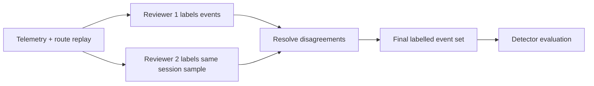
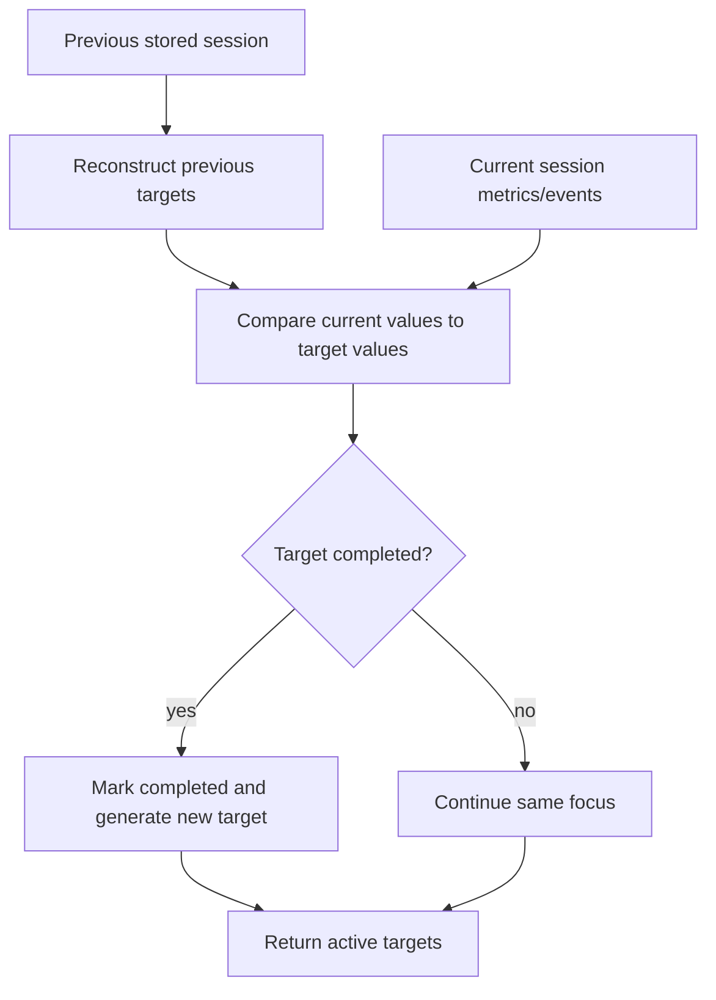

# Metrics and Evaluation

## Purpose

This document defines the deterministic driving metrics, risk-event rules, context-aware thresholds, coaching targets, and agent evaluation gates used by DriveCoach AI.

The product has two separate evaluation layers:

1. Driving analysis evaluation

   What happened in the driving session, according to telemetry and route context?

2. Agent quality evaluation

   Is the AI coach output specific, evidence-grounded, measurable, route-aware, and bounded?

These layers must remain separate. The analysis layer calculates metrics and events. The LLM explains those outputs and turns them into coaching language, but it does not create the evidence.

## Reference Basis

The current metric design is research-informed and product-oriented. It is not a certified safety model.

| Area | How it informs DriveCoach AI | Sources |
| --- | --- | --- |
| Vehicle lateral dynamics | Lateral demand is related to speed, curvature, and yaw rate. This supports using lateral acceleration, yaw-rate RMS, route curvature, and speed-normalised lateral demand. | Yaw-rate and lateral acceleration relationship: https://en.wikipedia.org/wiki/Yaw_%28dynamics%29; centripetal acceleration: https://en.wikipedia.org/wiki/Centripetal_force |
| Route geometry and road-network grounding | Route geometry, distance, duration, and optional annotations can be obtained from routing engines and OpenStreetMap-based tooling. This supports the route-grounded synthetic mode and future real route ingestion. | OSRM route API: https://project-osrm.org/docs/v5.24.0/api/; OSMnx paper: https://arxiv.org/abs/1611.01890 |
| Driving comfort and motion demand | Longitudinal and lateral acceleration contribute strongly to passenger comfort and perceived smoothness. This supports penalising high acceleration peaks, acceleration RMS, and high lateral demand. | Motion sickness and passenger comfort review: https://arxiv.org/abs/2501.17664 |
| ADAS / driver-assistance scope | Driver-assistance systems support the driver but do not remove driver responsibility at the relevant levels. This supports post-drive coaching language rather than autonomous-control or safety-certification claims. | NHTSA driver assistance technologies: https://www.nhtsa.gov/vehicle-safety/driver-assistance-technologies |
| Driver-state and wearable limits | Heart-rate and RR-interval features can describe physiological activation context, but DriveCoach must not diagnose stress, fatigue, health, or medical state. RMSSD is a standard time-domain HRV feature based on successive RR-interval differences. | HRV Task Force standard hosted by ESC: https://www.escardio.org/static_file/Escardio/Guidelines/Scientific-Statements/guidelines-Heart-Rate-Variability-FT-1996.pdf; HRV overview: https://en.wikipedia.org/wiki/Heart_rate_variability |
| RAG / AI evaluation | RAG systems should evaluate retrieval, grounding, relevance, and faithfulness separately. This supports evidence-used fields, retrieved-knowledge explainability, and coach usefulness scoring. | Ragas metrics: https://docs.ragas.io/en/stable/concepts/metrics/available_metrics/; RAGVUE diagnostic evaluation: https://arxiv.org/abs/2601.04196 |

Implementation note: thresholds and score weights are calibrated for the current MVP demo route and synthetic sessions. They are transparent heuristics intended for coaching and regression testing, not universal risk limits.

## Data Contract

### Required Sample Signals

The core analysis uses vehicle telemetry only:

| Field | Unit | Role |
| --- | --- | --- |
| `timestamp` | seconds | Time axis |
| `speed` | m/s | Speed profile and speed target comparison |
| `ax` | m/s^2 | Longitudinal acceleration, braking, throttle smoothness |
| `ay` | m/s^2 | Lateral acceleration and cornering demand |
| `yawRate` | rad/s | Heading-change demand and steering smoothness proxy |

### Optional Sample Signals

| Field | Unit | Role |
| --- | --- | --- |
| `steeringAngle` | degrees | Optional steering interpretation |
| `brake` | 0-1 | Optional braking intensity proxy |
| `throttle` | 0-1 | Optional throttle intensity proxy |
| `roadContext` | string | Route context such as campus, rural, curve, junction, urban |
| `segmentName` | string | Human-readable route segment |
| `targetSpeed` | m/s | Context-specific target speed used for route-aware checks |
| `curvatureLevel` | low / medium / high | Route curvature class |
| `trafficComplexity` | low / medium / high | Context complexity class |
| `expectedLateralDemand` | low / medium / high | Expected lateral-demand class |
| `heartRate` | bpm | Optional wearable context only |

## Driving Metrics

Driving metrics are calculated from the samples and detected risk events. All scores are clamped to `0-100`, where higher is better.

### Basic Session Metrics

| Metric | Formula | Interpretation |
| --- | --- | --- |
| `durationSeconds` | `last(timestamp) - first(timestamp)` | Session length |
| `meanSpeed` | `mean(speed)` | Average speed over the session |
| `maxSpeed` | `max(speed)` | Peak speed |
| `speedStd` | `sqrt(mean((speed - meanSpeed)^2))` | Speed variability |

Why these exist:

- Mean and max speed describe the overall route pace.
- Speed standard deviation helps identify speed variability, especially when combined with route context. A higher value is not automatically bad because urban routes naturally vary more than rural cruising.

### Longitudinal Metrics

| Metric | Formula | Interpretation |
| --- | --- | --- |
| `meanAbsAx` | `mean(abs(ax))` | Typical braking / acceleration demand |
| `maxAbsAx` | `max(abs(ax))` | Strongest braking or acceleration demand |
| `accelerationRms` | `sqrt(mean(ax^2))` | Overall longitudinal motion energy |

Why these exist:

- Longitudinal acceleration is a direct signal for braking and throttle smoothness.
- Mean absolute acceleration captures repeated control effort.
- Peak absolute acceleration captures short harsh events.
- RMS is used because it increases with sustained or repeated high-magnitude acceleration.

### Lateral and Yaw Metrics

| Metric | Formula | Interpretation |
| --- | --- | --- |
| `meanAbsAy` | `mean(abs(ay))` | Typical lateral demand |
| `maxAbsAy` | `max(abs(ay))` | Strongest cornering / lateral event |
| `yawRateRms` | `sqrt(mean(yawRate^2))` | Overall heading-change demand |

Why these exist:

- Vehicle dynamics links yaw rate and lateral acceleration during turning: `lateral acceleration ~= speed * yawRate`; for a constant-radius turn, `lateral acceleration ~= speed^2 / radius`.
- This means a curve taken faster, or with tighter radius, increases lateral demand.
- Yaw-rate RMS helps identify repeated or abrupt heading-change demand, especially around bends and junctions.

## Score Formulas

### Event Severity Penalty

Each detected event contributes a penalty:

| Severity | Penalty |
| --- | ---: |
| low | 1.5 |
| medium | 4 |
| high | 8 |

Formula:

```text
eventPenalty = sum(severityPenalty(event) for event in events)
```

Rationale:

- Severity matters more than raw event count.
- A session with one high-severity event should not be treated the same as a session with one low-severity event.
- The weights are MVP product heuristics and should be recalibrated when labelled real data is available.

### Longitudinal Smoothness Score

Implemented formula:

```text
longitudinalSmoothnessScore =
  clamp(
    100
    - meanAbsAx * 14
    - maxAbsAx * 5.2
    - eventPenalty * 0.35,
    0,
    100
  )
```

Interpretation:

- Penalises repeated acceleration/braking demand through `meanAbsAx`.
- Penalises short harsh braking or acceleration peaks through `maxAbsAx`.
- Penalises detected events lightly so the score reflects both continuous control and discrete risk moments.

### Lateral Stability Score

Implemented formula:

```text
lateralStabilityScore =
  clamp(
    100
    - meanAbsAy * 15
    - maxAbsAy * 6.2
    - yawRateRms * 32
    - eventPenalty * 0.3,
    0,
    100
  )
```

Interpretation:

- Penalises sustained lateral demand through `meanAbsAy`.
- Penalises high cornering demand through `maxAbsAy`.
- Penalises repeated yaw motion through `yawRateRms`.
- Applies a small event penalty when the session also contains route-aware lateral or yaw events.

### Event Safety Score

Implemented formula:

```text
eventSafetyScore = clamp(100 - eventPenalty, 0, 100)
```

Interpretation:

- This is a compact event burden score.
- It is not a crash-risk estimate or regulatory safety rating.

### Context Adaptation Score

Implemented formula:

```text
speedTargetPenalty =
  mean(max(0, speed - targetSpeed) * 2.2)

lateralContextPenalty =
  mean(max(0, abs(ay) - contextAllowance) * 12)

urbanInstabilityPenalty =
  mean(max(0, abs(ax) - 0.9) * 7 for urban_arrival samples)

curveEntryPenalty =
  mean(max(0, speed - targetSpeed) * 4 for first 18 country_curve samples)

contextEventPenalty =
  count(late_braking_before_curve, high_speed_in_curve, unstable_cornering) * 4

contextAdaptationScore =
  clamp(
    100
    - speedTargetPenalty
    - lateralContextPenalty
    - urbanInstabilityPenalty
    - curveEntryPenalty
    - contextEventPenalty,
    0,
    100
  )
```

Context allowance:

| Expected lateral demand | Allowance |
| --- | ---: |
| low | 0.8 m/s^2 |
| medium | 1.45 m/s^2 |
| high | 2.15 m/s^2 |

Interpretation:

- The same acceleration is judged differently in a campus exit, rural straight, country-road bend, junction, or urban arrival.
- This score makes the analysis route-aware instead of treating the whole trip as one generic time series.
- The route-aware design is supported by the vehicle dynamics relationship between speed, curvature, yaw rate, and lateral acceleration.

### Overall Driving Score

Implemented formula:

```text
overallDrivingScore =
  clamp(
    0.35 * longitudinalSmoothnessScore
    + 0.30 * lateralStabilityScore
    + 0.20 * eventSafetyScore
    + 0.15 * contextAdaptationScore,
    0,
    100
  )
```

Weighting rationale:

- Longitudinal smoothness is weighted most because braking and throttle transitions are core coaching behaviours.
- Lateral stability is nearly as important because cornering demand and yaw motion are central to route-aware driving review.
- Event safety captures the discrete event burden.
- Context adaptation rewards matching speed and motion demand to the route segment.

Current limitation:

- These weights are product heuristics. They should be evaluated against human-labelled session reviews and adjusted per vehicle class, route type, and user goal.

## Optional Driver-State Metrics

Wearable data is optional and never required for the core product.

### Heart-Rate Features

| Metric | Formula | Interpretation |
| --- | --- | --- |
| `meanHeartRate` | `mean(heartRate)` | Average heart-rate value during session |
| `maxHeartRate` | `max(heartRate)` | Peak heart-rate value |
| `baselineHeartRate` | Mean of first 60 seconds if available; otherwise first 20% of wearable samples | Early-session comparison baseline |
| `heartRateDeltaPercent` | `(meanHeartRate - baselineHeartRate) / baselineHeartRate * 100` | Relative change from baseline |

Policy:

- Heart-rate features are optional physiological activation indicators.
- The product does not diagnose stress, fatigue, health, or medical state.
- Vehicle telemetry remains the core evidence source.

### RR-Interval / RMSSD

If RR intervals are available in future ingestion:

```text
successiveDiffs = rr[i] - rr[i - 1]
rmssd = sqrt(mean(successiveDiffs^2))
```

Rationale:

- RMSSD is a standard time-domain HRV metric based on successive RR / NN interval differences.
- In DriveCoach AI it should only be used as optional driver-state context, not a medical conclusion.

## Risk Event Detection

The detector uses rule-based event detection. Consecutive matching samples are merged into event segments. Each event returns:

```json
{
  "id": "...",
  "type": "...",
  "startTime": 0,
  "endTime": 0,
  "severity": "low | medium | high",
  "evidence": {},
  "roadContext": "...",
  "segmentName": "...",
  "contextualExplanation": "...",
  "shortExplanation": "...",
  "coachingSuggestion": "..."
}
```

### Base Event Thresholds

| Event type | Base rule | Evidence key | Coaching interpretation |
| --- | --- | --- | --- |
| `late_braking_before_curve` | `ax < -3.0` before / at a curve | `peakDeceleration` | Braking was delayed before a higher-demand bend |
| `harsh_braking` | `ax < -3.0` | `peakDeceleration` | Deceleration exceeded the braking threshold |
| `harsh_acceleration` | `ax > 2.5` | `peakAcceleration` | Throttle demand rose sharply |
| `high_lateral_acceleration` | `abs(ay) > 2.0` | `peakLateralAcceleration` | Cornering demand was elevated |
| `sharp_yaw_motion` | `abs(yawRate) > 0.35` | `peakYawRate` | Heading change / steering correction was abrupt |
| `high_speed_in_curve` | `speed - targetSpeed > 2.5` in high curvature | `speedAboveTarget` | Speed stayed above target through a bend |
| `unstable_cornering` | `abs(ay) + abs(yawRate) * 2 > 2.2` in high curvature | `combinedCorneringDemand` | Lateral and yaw demand rose together |
| `unstable_speed_control` | `localSpeedRange > 4.0` and at least 3 acceleration sign changes | `localSpeedRange` | Stop-go or repeated pedal transitions |

Threshold rationale:

- The base thresholds are deliberately simple and transparent.
- `3.0 m/s^2` deceleration and `2.5 m/s^2` acceleration are treated as harsh-control triggers for the MVP.
- `2.0 m/s^2` lateral acceleration is treated as high lateral demand for a comfort-oriented post-drive review.
- `0.35 rad/s` yaw rate is treated as a sharp heading-change trigger.
- These values are not universal safety limits. They should be calibrated with real vehicle class, tyres, road friction, route geometry, and labelled driver-review data.

### Local Speed Instability

Implemented rolling-window features:

```text
window = samples[index - 4 : index + 5]
localSpeedRange = max(speed in window) - min(speed in window)
accelerationSignChanges =
  count(sign(ax[i]) != sign(ax[i - 1]) in window)
```

Event rule:

```text
unstable_speed_control =
  roadContext in {urban_arrival, roundabout_or_junction, village_approach}
  and localSpeedRange > contextThreshold
  and accelerationSignChanges >= 3
```

Rationale:

- Speed variability alone is not enough because some urban routes require speed changes.
- The detector therefore combines local speed range, repeated acceleration sign changes, and route context.

## Context-Aware Thresholds

The current detector does not use the base threshold directly. It adjusts thresholds using route context.

Inputs:

- `roadContext`
- `targetSpeed`
- `speed / targetSpeed`
- `curvatureLevel`
- `trafficComplexity`
- `expectedLateralDemand`
- `speedNormalisedLateralDemand`

### Context Profiles

Each route context has threshold multipliers:

| Context | Longitudinal multiplier | Lateral multiplier | Yaw multiplier | Speed multiplier | Reason |
| --- | ---: | ---: | ---: | ---: | --- |
| `campus_exit` | 0.72 | 0.55 | 0.75 | 0.70 | Low-speed campus context expects gentle control |
| `rural_straight` | 1.08 | 0.85 | 0.90 | 1.10 | Open rural straight allows more speed variation but low lateral demand |
| `village_approach` | 0.90 | 0.82 | 0.90 | 0.72 | Village approach expects earlier speed reduction |
| `country_curve` | 0.95 | 1.05 | 1.08 | 0.68 | Bend is judged against route target speed and lateral demand |
| `arterial_cruise` | 1.02 | 0.85 | 0.88 | 1.00 | Arterial approach expects stable cruising |
| `roundabout_or_junction` | 0.82 | 0.90 | 0.86 | 0.62 | Junction context expects lower speed and smoother transitions |
| `urban_arrival` | 0.80 | 0.72 | 0.78 | 0.65 | Urban arrival has lower speed tolerance with some stop-go allowance |
| `destination` | 0.62 | 0.55 | 0.65 | 0.55 | Destination arrival expects very low-speed manoeuvring |

### Curvature and Traffic Multipliers

Curvature multipliers:

```text
low = 0.82
medium = 0.95
high = 1.12
```

Traffic complexity multipliers:

```text
low = 1.08
medium = 1.00
high = 0.86
```

Interpretation:

- Higher traffic complexity lowers tolerance because smoother control is expected around dense urban, junction, and arrival contexts.
- Curvature adjusts lateral and yaw thresholds because turns naturally create lateral acceleration and yaw motion.
- High curvature does not automatically mean "bad"; it changes what should be expected.

### Speed-Normalised Lateral Demand

Implemented formula:

```text
expectedFromYaw = max(speed * abs(yawRate), 0.1)
expectedFromContext =
  low: 0.85
  medium: 1.45
  high: 2.05

expected = max(expectedFromYaw, expectedFromContext)
speedNormalisedLateralDemand = abs(ay) / expected
```

Rationale:

- Lateral acceleration should be interpreted relative to speed, yaw rate, and expected route demand.
- This reduces false positives where a curve naturally produces lateral acceleration.
- It also identifies cases where lateral acceleration is high relative to what the speed and route context suggest.

### Severity

Event severity is based on how far event magnitude exceeds the adjusted threshold:

```text
ratio = eventMagnitude / adjustedThreshold

if ratio >= 1.55: severity = high
elif ratio >= 1.20: severity = medium
else: severity = low
```

Rationale:

- Severity should reflect exceedance beyond context-aware expectation, not just raw signal magnitude.

## Calibration Plan

The current thresholds are transparent MVP heuristics. Before DriveCoach AI can be used with real drivers, fleets, simulator studies, or ADAS-on/off comparison, the event thresholds and score weights need to be calibrated against reviewed data.

Calibration has five goals:

1. Reduce false positives where the detector flags normal route behaviour.
2. Reduce false negatives where meaningful events are missed.
3. Make thresholds context-aware across road type, speed range, curvature, vehicle class, and driving condition.
4. Keep the AI coach grounded in validated event evidence.
5. Preserve product interpretability: users should still understand why an event was detected.

### 1. Build a Calibration Dataset

The calibration dataset should contain repeated sessions with aligned telemetry and route context.

Required data:

| Data type | Required fields | Purpose |
| --- | --- | --- |
| Vehicle telemetry | timestamp, speed, ax, ay, yawRate | Core event detection and metric calculation |
| Route context | roadContext, segmentName, targetSpeed, curvatureLevel | Context-aware threshold calibration |
| Route geometry | distance, polyline, curvature proxy, junction / bend markers | Route-grounded interpretation |
| Session metadata | vehicle type, route id, weather if available, ADAS mode if available | Comparison and stratified analysis |
| Human labels | event type, start/end time, severity, reviewer confidence | Ground truth for event evaluation |

Recommended collection phases:

1. Synthetic route-grounded sessions

   Use the current Cranfield to Milton Keynes scenario and fixed-seed ground-truth sessions to test pipeline stability.

2. Simulator sessions

   Use CARLA or comparable simulation logs to generate repeatable route events where ground truth is easier to control.

3. Controlled real telemetry

   Record a small number of repeated route sessions with known route segments and consented data collection.

4. Broader real-world sessions

   Expand to more routes, vehicle types, drivers, and conditions only after the labelling process is stable.

### 2. Human Reviewer Event Labelling

Human labels are needed because raw acceleration peaks do not always equal meaningful coaching events.

Reviewers should label events using a simple annotation protocol:

| Label field | Description |
| --- | --- |
| `eventType` | One of the supported event types, or `no_event` |
| `startTime` / `endTime` | Event time range |
| `segmentName` | Route segment where the event happened |
| `roadContext` | Context such as rural straight, bend, junction, urban arrival |
| `severity` | low / medium / high |
| `primaryEvidence` | Main evidence: ax, ay, yawRate, speed above target, local speed range |
| `reviewerConfidence` | low / medium / high |
| `notes` | Short explanation, especially for ambiguous events |

Recommended review workflow:



Annotation guidance:

- Label the behaviour pattern, not only the largest signal spike.
- Use route context: braking before a bend is different from braking in urban traffic.
- Mark uncertain cases as low confidence instead of forcing a label.
- Do not label heart-rate change as a risk event. Wearable data remains optional context.

Reviewer agreement:

- For event type agreement, use percent agreement initially.
- For mature datasets, add Cohen's kappa or Krippendorff's alpha.
- Exclude low-confidence labels from threshold calibration or treat them as a separate ambiguity set.

### 3. Event Detector Evaluation

The detector should be evaluated against human-labelled event windows.

Definitions:

| Term | Meaning |
| --- | --- |
| True Positive | Detector event overlaps a human-labelled event of the same type |
| False Positive | Detector event has no matching human-labelled event |
| False Negative | Human-labelled event has no matching detector event |
| True Negative | Non-event window correctly left unflagged |

Window matching rule:

```text
overlapRatio =
  intersection(detectorWindow, humanWindow)
  / union(detectorWindow, humanWindow)

matched = sameEventType and overlapRatio >= 0.30
```

The `0.30` overlap threshold is a practical starting point because event timing can differ slightly between reviewers and detectors. It should be tuned during calibration.

Core metrics:

```text
precision = truePositive / (truePositive + falsePositive)
recall = truePositive / (truePositive + falseNegative)
f1 = 2 * precision * recall / (precision + recall)
falsePositiveRate = falsePositive / labelledNonEventWindows
```

Recommended reporting:

| Report level | Metrics |
| --- | --- |
| Overall detector | macro precision, macro recall, macro F1 |
| Per event type | precision, recall, F1 for harsh braking, lateral acceleration, yaw, speed control |
| Per context | metrics for campus, rural straight, village, curve, junction, urban arrival |
| Per severity | low / medium / high detection performance |
| Per route | route-level event count error and top-event agreement |

Product target for early calibration:

- High recall for medium/high severity events.
- Acceptable precision for low severity events.
- Low false positives in smooth baseline scenarios.
- Stable event ranking: the top coaching focus should match reviewer judgement.

### 4. Updating Context-Aware Thresholds

Threshold updates should be made per event type and per context group, not only globally.

Current threshold form:

```text
adjustedThreshold =
  baseThreshold
  * contextMultiplier
  * curvatureMultiplier
  * trafficMultiplier
  * optionalSpeedRatioAdjustment
```

Calibration process:

1. Start with the current base thresholds.
2. Run the detector over labelled sessions.
3. Compute precision / recall by event type and road context.
4. Identify systematic errors.
5. Adjust one multiplier family at a time.
6. Re-run evaluation on a held-out validation set.
7. Record the threshold version and calibration notes.

Example updates:

| Observation | Likely update |
| --- | --- |
| Too many lateral events in high-curvature bends | Increase high-curvature lateral allowance or raise `country_curve.ay` multiplier |
| Missed late braking before village or bend | Lower `village_approach.ax` or late-braking speed-ratio adjustment |
| Too many unstable-speed events in urban traffic | Increase `urban_arrival.speed_range` allowance or require more acceleration sign changes |
| Missed harsh acceleration near junction exit | Lower high-traffic harsh-acceleration threshold or add junction-exit subcontext |
| False sharp-yaw events in roundabouts | Separate expected roundabout yaw from abrupt yaw correction |

Calibration files:

Future implementations should move threshold profiles into versioned configuration files:

```text
config/
  thresholds/
    v0_demo_cranfield_mk.json
    v1_labelled_simulator.json
    v2_controlled_real_route.json
```

Each version should include:

- supported route contexts
- base thresholds
- context multipliers
- calibration dataset id
- validation metrics
- known limitations
- date and reviewer notes

### 5. Score Weight Calibration

Score weights should be calibrated separately from event thresholds.

Current overall score:

```text
overallDrivingScore =
  0.35 * longitudinalSmoothnessScore
  + 0.30 * lateralStabilityScore
  + 0.20 * eventSafetyScore
  + 0.15 * contextAdaptationScore
```

Calibration approach:

1. Ask reviewers to provide an overall session assessment:

   - smooth / acceptable / needs attention
   - main coaching focus
   - confidence

2. Compare score ordering with reviewer ordering.

3. Adjust weights to improve:

   - rank correlation with reviewer assessment
   - agreement on top coaching focus
   - separation between smooth baseline and event-heavy sessions

4. Keep the score explainable.

Do not overfit scores to one route. Score calibration should be evaluated by route type and session scenario.

### 6. ADAS-On / ADAS-Off Comparison Controls

For future ADAS evaluation, the comparison must control for confounding factors. A single score difference is not enough to claim that ADAS improved or worsened driving.

Recommended comparison design:

| Control variable | Reason |
| --- | --- |
| Same or comparable route | Different route geometry changes acceleration, yaw, and speed demand |
| Similar traffic period | Traffic density affects braking and speed variation |
| Similar weather / road surface | Road friction and visibility affect driving behaviour |
| Same vehicle or vehicle class | Vehicle dynamics and braking feel differ by vehicle |
| Same driver where possible | Driver style affects baseline behaviour |
| Same instrumentation | Sensor sampling rate and filtering affect metrics |
| Matched segment analysis | Route-level averages can hide bend, junction, or urban differences |

Recommended ADAS comparison metrics:

- change in harsh braking event count
- change in high lateral acceleration count
- change in yaw-rate RMS on curve / junction segments
- change in speed target adherence
- change in longitudinal smoothness score
- change in context adaptation score
- change in target completion rate
- optional driver-state context, reported without medical claims

Example comparison statement:

```text
Compared with the manual baseline on the same route, the ADAS-assisted session showed fewer late-braking events before the rural bend and lower yaw-rate RMS around the junction segment. This suggests smoother route adaptation in those segments, but the result should be interpreted as a session-level behaviour indicator rather than a safety certification.
```

### 7. Calibration Acceptance Gates

A threshold version should not replace the current demo configuration unless it passes acceptance gates.

Suggested gates:

| Gate | Minimum expectation |
| --- | --- |
| Reproducibility | Same dataset and threshold version produce identical events |
| Event coverage | All supported event types have labelled examples |
| Medium/high severity recall | Medium/high events are prioritised for recall |
| Smooth baseline false positives | Smooth sessions should have few or no risk events |
| Context reporting | Metrics are reported by route context, not only overall |
| Reviewer agreement | Ambiguous labels are identified and excluded or separated |
| Documentation | Threshold version includes dataset, metrics, limitations, and owner |

Until these gates are met, threshold changes should remain experimental.

## Coaching Targets

Coaching targets turn analysis into measurable next-drive goals.

Example:

```json
{
  "title": "Reduce late or harsh braking",
  "baselineValue": 2,
  "targetValue": 1,
  "unit": "events",
  "measurement": "Count braking-related events and review peak longitudinal deceleration.",
  "whyItMatters": "Earlier braking improves comfort and predictability.",
  "nextAction": "Begin reducing speed earlier before similar bends or junction approaches."
}
```

Target rules:

- A target must be linked to a metric, event type, route context, or previous-session comparison.
- A target must have a measurable next-session check.
- The AI coach may explain the target but should not invent new measurement criteria.

## Target Completion Loop



Current completion policy:

- If the target metric improves beyond the target value, mark completed.
- If the same event type remains above target, continue the same focus.
- If completed, generate a new target from the current highest-priority pattern.

This supports progress-oriented coaching without creating a heavy driver identity profile.

## Memory-Aware Evaluation

SQLite session memory supports:

- previous-session comparison
- score trend
- repeated pattern detection
- watch item generation
- target completion

Policy:

- Recent memory is for measurable comparison only.
- It is not a behavioural diagnosis.
- It is not a persistent driver identity model.

## Agent Report Evaluation

Report evaluation checks whether a generated coach report is safe and useful.

### Structural Checks

| Check | Requirement |
| --- | --- |
| `schema_completeness` | Required report fields exist |
| `metric_evidence_present` | Report includes deterministic metric evidence |
| `knowledge_grounding_present` | Report includes retrieved knowledge |
| `retrieval_explainability_present` | Retrieved snippets include `matchedBy`, `whyUsed`, and retrieval mode |
| `knowledge_event_type_coverage` | Knowledge covers top detected event types |
| `route_context_present` | Report references route context |
| `event_coverage` | Top detected events are reflected in the report |
| `no_unsupported_medical_claims` | Report avoids fatigue, stress, health, or diagnosis claims |

### Quality Dimensions

| Dimension | What it checks | Implementation signal |
| --- | --- | --- |
| `suggestion_specificity` | Suggestions contain concrete action language and route/event context | Counts action terms, context terms, event references, segment references, and useful length |
| `target_measurability` | Next-drive focus can be checked against observable signals | Counts numeric evidence and measurement terms |
| `route_context_relevance` | Report references route, segment, or context evidence | Counts route terms, segment terms, and route-context section |
| `no_overclaim_score` | Report avoids unsupported certainty, diagnosis, or overclaiming | Penalises unsupported medical and certainty language |
| `coach_usefulness_score` | Composite usefulness score | Weighted combination of quality dimensions, event coverage, and knowledge coverage |

Implemented composite:

```text
coachUsefulnessScore =
  0.28 * suggestionSpecificity
  + 0.22 * targetMeasurability
  + 0.24 * routeContextRelevance
  + 0.16 * noOverclaimScore
  + 0.05 * eventCoverage
  + 0.05 * knowledgeCoverage
```

Final report score:

```text
qualityScore =
  0.55 * structuralScore
  + 0.45 * coachUsefulnessScore
```

Pass rule:

- No blocking schema or unsupported-medical failures.
- `qualityScore >= 75`.

## Knowledge Evaluation

Knowledge evaluation checks whether the RAG-lite knowledge base is healthy before it is used.

Checks:

- unique knowledge IDs
- schema completeness
- valid confidence values
- accepted source provenance
- required evidence, wearable, and driver-assistance policy snippets
- event-type coverage
- `doSay` / `doNotSay` presence
- retrieval smoke cases
- explainable retrieval metadata

Endpoint:

```text
GET /api/knowledge/evaluation
```

Rationale:

- RAG quality should not be judged only from the final answer.
- Retrieval coverage, source provenance, and explanation metadata are separate quality gates.
- This follows the same broad evaluation direction as RAG frameworks that separate context precision, recall, faithfulness, and answer relevance.

## Ground-Truth Scenarios

| Scenario | Purpose |
| --- | --- |
| `smooth_baseline` | Low-risk reference session |
| `harsh_braking` | Braking-focused risk-event fixture |
| `high_lateral_acceleration` | Cornering and lateral-demand fixture |
| `unstable_speed_control` | Speed-variation fixture |
| `wearable_connected` | Optional wearable context fixture |
| `wearable_not_connected` | Vehicle-only fixture |
| `agent_generated` | Seeded random demo for memory comparison |

These scenarios provide stable regression fixtures for:

- coach report generation
- LangGraph workflow validation
- RAG-lite retrieval
- memory comparison
- target completion
- frontend UI behaviour

## Observability

Agent traces are stored in:

```text
data/agent_observability.sqlite
```

Trace records include:

- session id
- scenario
- route
- metrics
- compact event summaries
- workflow engine
- workflow nodes
- fallback reason when applicable
- retrieved knowledge
- evidence used
- evaluation

Endpoint:

```text
GET /api/agent-traces/recent?limit=10
```

## Evaluation Limitations

- Current metrics are not validated on real fleet data.
- Context-aware thresholds are calibrated for the Cranfield to Milton Keynes demo route, not all roads.
- Synthetic route sessions are useful for product and regression testing but are not real driver data.
- LLM evaluation is heuristic and deterministic, not a human-labelled benchmark.
- Knowledge base quality is checked structurally; it is not yet a full retrieval benchmark.
- Heart-rate metrics are optional context only and should not be interpreted medically.
- The score weights are transparent product heuristics and should not be presented as universal safety ratings.

## Future Evaluation Work

1. Add real telemetry datasets and compare detected events against human-reviewed labels.
2. Calibrate thresholds by vehicle class, road surface, weather, tyre condition, and route type.
3. Add route-specific calibration files for campus, rural, urban, motorway, and junction contexts.
4. Add A/B evaluation for generic AI summaries versus evidence-grounded AI coaching.
5. Add scenario-level expected-output fixtures for coach reports.
6. Add regression tests for LLM and fallback report structure.
7. Add evaluator dashboards for report quality over time.
8. Add human feedback loop for coaching usefulness.
9. Add ADAS-on versus ADAS-off comparison metrics once comparable real or simulator sessions are available.
