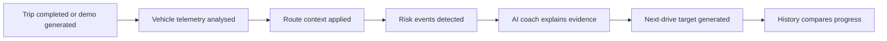
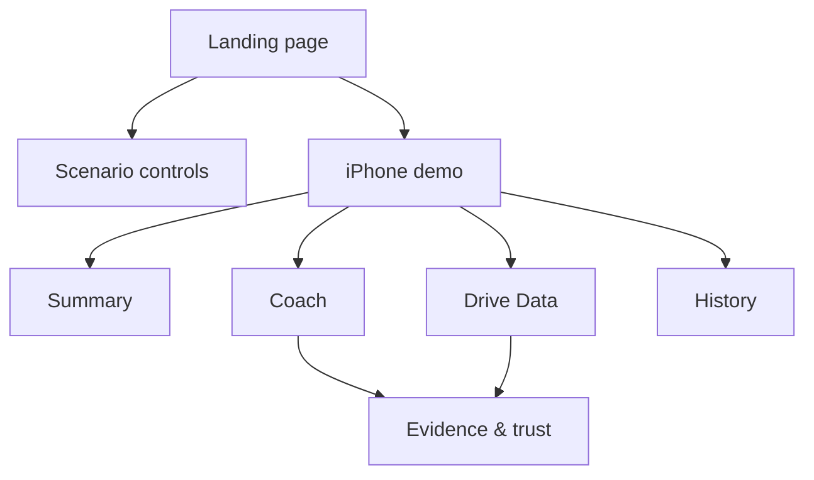

# Product Requirements Document

## 1. Project Overview

### 1.1 Project Origin

Human-Centred AI Driving Coach was inspired by two postgraduate modules: Human Factors and Ethics, Safety and Regulation. In the Human Factors coursework, the project team studied how a lane-keeping function could influence a driver's psychological state and driving state. That work raised a broader product question:

Can driver performance be quantified from vehicle behaviour and driver-state signals, and can those indicators be turned into practical feedback that helps a driver improve?

This project extends that question into an AI product prototype. Instead of treating driving telemetry as raw engineering data, DriveCoach AI explores whether route context, vehicle motion, and optional wearable signals can be transformed into post-drive coaching. It also creates a foundation for a later research direction: comparing driving performance before and after ADAS use, such as lane keeping or lane centering, to understand how assistance changes driver behaviour and whether the change is desirable.

The project is therefore positioned at the intersection of:

- human factors and driver behaviour
- connected-vehicle telemetry
- ADAS / intelligent driving evaluation
- evidence-grounded AI coaching
- ethical and safety-aware AI product design

### 1.2 One-Sentence Positioning

DriveCoach AI is a route-aware post-drive coaching product that turns connected-vehicle telemetry into evidence-grounded driving behaviour insights and measurable next-drive improvement targets.

### 1.3 Product Positioning

The product is not a real-time in-car warning system and not a medical assessment tool. It is a post-drive review and coaching product.

The core product decision is:

- deterministic analytics calculate metrics and risk events
- the AI coach explains the evidence and turns it into practical guidance
- optional wearable data can enrich driver-state context, but vehicle telemetry remains the main signal

The first interactive MVP uses route-grounded synthetic data because real connected-vehicle data is not yet available. The synthetic route is clearly labelled as not real driver data.

## 2. Background and Product Context

### 2.1 ADAS and Human-Centred Evaluation Context

Driver assistance technologies are increasingly common. NHTSA describes technologies such as adaptive cruise control, lane centering assistance, and lane keeping assistance as systems that support drivers with warnings or vehicle control assistance, while still requiring the driver to understand the system and remain responsible at lower automation levels.

This creates a human-centred evaluation problem. When ADAS is active, the driving task becomes a shared-control situation rather than a purely manual task. The driver may brake, steer, accelerate, monitor, trust, resist, or over-rely on the system. A product that only reports raw speed or acceleration misses the human factors layer: how the driver's behaviour and the vehicle's behaviour interact over the route.

Research on driver monitoring also shows that driver state is multi-dimensional and can be inferred from different signals, including vehicle behaviour, environment, and sensors. However, a consumer-facing product must be careful not to overclaim. A heart-rate signal, for example, can be used as optional physiological activation context, but it should not become a stress, fatigue, or health diagnosis.

### 2.2 Current Review Experience

Today, a driver or evaluator may have access to:

- vehicle logs
- simulator logs
- CAN-derived telemetry
- ROS bag exports
- CSV files
- dashboard charts
- manual notes

These sources can be accurate but difficult to interpret. They often answer "what were the signals?" but not:

- what was the main behavioural pattern?
- where did the issue happen on the route?
- why does it matter for comfort, stability, or predictability?
- what should the driver focus on next time?
- did this session improve compared with a previous session?

### 2.3 Existing Alternatives and Gaps

| Existing approach | Strength | Gap |
| --- | --- | --- |
| Raw telemetry dashboard | Accurate and detailed | Too technical for driver coaching |
| Manual engineering report | Contextual and expert-led | Slow, not interactive, not scalable |
| Generic LLM summary | Easy to read | Can overgeneralise or invent unsupported claims |
| Fitness / route review apps | Strong session-review UX | Not built for driving behaviour or ADAS context |
| Driver monitoring systems | Real-time state monitoring | Not focused on post-drive coaching and route evidence |

DriveCoach AI aims to combine the strengths of telemetry dashboards and AI summaries while avoiding their weaknesses.

### 2.4 Reference Products and Design Inspiration

DriveCoach AI is not a direct clone of any existing product. The intended product experience combines patterns from several categories:

| Reference category | Useful pattern | What DriveCoach adopts | What DriveCoach avoids |
| --- | --- | --- | --- |
| Apple Health / fitness session review | Clear session summary, trends, simple health-style cards | Calm post-session review, progress over time, readable score summaries | Medical diagnosis or health claims |
| Strava / route review apps | Route-first session narrative and event-like moments | Route-aware trip review and spatial context | Social competition and leaderboard framing |
| Connected-vehicle analytics dashboards | Telemetry evidence, trip metrics, event detection | Deterministic vehicle metrics and risk-event evidence | Dense engineering UI as the default user experience |
| ADAS / driver monitoring research tools | Human-centred evaluation and driver-state context | Optional wearable context and ADAS-on/off research direction | Real-time safety certification or driver surveillance framing |
| AI assistant products | Conversational explanation and follow-up questions | Ask DriveCoach and structured coaching summary | Generic advice not grounded in evidence |

The product opportunity is to make driving telemetry review feel as understandable as a consumer session-review app while preserving the evidence discipline expected from an engineering analytics tool.

## 3. Core Problem Definition

### 3.1 Core Problem

The core problem is not a lack of driving data. The core problem is the gap between high-volume vehicle telemetry and actionable, evidence-grounded coaching.

Vehicle telemetry can describe speed, acceleration, yaw, lateral demand, braking, and route progress. But most users cannot directly translate those signals into a clear answer:

What happened, why did it matter, and what should I improve next time?

### 3.2 Product Hypothesis

If deterministic metrics and route-aware events are calculated first, then an AI coach can generate more trustworthy and useful guidance because its language is grounded in observable evidence.

### 3.3 Why Route Context Matters

The same vehicle signal can mean different things in different contexts:

- lateral acceleration on a rural bend is different from lateral acceleration in a car park
- braking near a junction is different from braking during open-road cruising
- speed variation in urban arrival is different from speed variation on a rural link
- yaw motion during a curve may be expected, but abrupt yaw correction may indicate instability

Therefore, DriveCoach does not treat the trip as one generic time series. It interprets events using route segments such as campus departure, rural road, village approach, bend, junction, roundabout, and urban arrival.

## 4. User Pain Points

### Pain Point 1: Drivers cannot easily understand raw telemetry

Speed, longitudinal acceleration, lateral acceleration, and yaw rate are meaningful signals, but they are not naturally readable as coaching feedback.

The product should translate these signals into behaviour concepts such as late braking, high corner entry speed, unstable speed control, or elevated lateral demand.

### Pain Point 2: Risk events lack route explanation

A harsh braking or high lateral acceleration event is less useful without knowing where it happened and what type of road context surrounded it.

The product should explain whether the event happened around a rural bend, village approach, junction context, or urban arrival.

### Pain Point 3: AI advice can become generic

Without deterministic evidence, an AI coach may simply say "drive more smoothly" or repeat the score. That is not enough.

The product should connect every main suggestion to evidence:

- event type
- segment name
- metric value
- route context
- previous target or previous session when available

### Pain Point 4: Drivers need one clear next focus, not a long report

A full engineering report can be useful, but a driver needs a small number of actionable next-drive goals.

The product should prioritise:

- one main behavioural focus
- one measurable next-drive target
- a small amount of key evidence

### Pain Point 5: ADAS evaluation needs before/after comparison

If this product later evaluates lane keeping, lane centering, or other ADAS functions, a single-session score is not enough.

The product should support comparing:

- manual driving vs ADAS-assisted driving
- previous session vs current session
- target set vs target completion
- repeated route patterns over time

### Pain Point 6: Wearable data can be misinterpreted

Heart rate may add context, but it can easily be overinterpreted.

The product must clearly state that wearable data is optional and does not support medical, stress, fatigue, or health diagnosis.

## 5. Product Goals

### 5.1 User Goals

Help the user answer:

1. How did this drive go overall?
2. Where did the main behaviour issue happen?
3. What evidence supports the finding?
4. Why does it matter for comfort, stability, or predictability?
5. What should I focus on next drive?
6. Did I improve compared with the previous session?

### 5.2 Product Goals

- Make route-aware driving review understandable.
- Keep the AI coach grounded in deterministic evidence.
- Reduce default UI noise while preserving technical trust details.
- Show a complete product flow without requiring CSV upload.
- Demonstrate a scalable foundation for future real-data ingestion and ADAS evaluation.

### 5.3 Technical Goals

- Maintain a frontend-compatible `SampleTrip` contract.
- Keep metrics and event detection deterministic.
- Keep LLM generation optional and fallback-safe.
- Support route-grounded synthetic sessions until real data is available.
- Store lightweight session memory for comparison.
- Evaluate report quality beyond schema correctness.

### 5.4 Target User Personas

#### Persona 1: ADAS / Intelligent Driving Evaluator

Profile:

- Works with vehicle logs, simulator sessions, or connected-vehicle telemetry.
- Needs to explain how a driver or vehicle behaved across a route.
- Cares about evidence, repeatability, route context, and evaluation traceability.

Needs:

- Quickly identify braking, acceleration, lateral-demand, and speed-control issues.
- Understand where events happened on the route.
- Compare sessions under different conditions, such as manual driving vs ADAS-assisted driving.
- Use AI summaries without losing access to deterministic evidence.

Success moment:

The evaluator can say, "This route had late braking before the rural bend and less stable speed control near the urban arrival, and the evidence is visible."

#### Persona 2: Driver / Learner Reviewing a Completed Trip

Profile:

- Does not want to inspect raw telemetry.
- Wants simple, practical feedback after a trip.
- May not understand acceleration, yaw rate, or lateral demand as engineering terms.

Needs:

- One clear assessment of the drive.
- A small number of specific, route-aware coaching suggestions.
- A next-drive focus that feels achievable.
- Confidence that the AI is not inventing the result.

Success moment:

The driver can say, "Next time, I should reduce speed earlier before similar bends and keep pedal inputs smoother in urban traffic."

#### Persona 3: Human Factors / Safety Research Student

Profile:

- Interested in how ADAS changes driving behaviour and driver state.
- May use simulator data, CSV exports, or controlled route scenarios.
- Needs a prototype that demonstrates product thinking and research logic.

Needs:

- A transparent link between telemetry, behaviour interpretation, and coaching output.
- Optional driver-state context without medical overclaiming.
- Documentation that explains assumptions, limitations, and future validation.

Success moment:

The researcher can use DriveCoach as a structured prototype for discussing how driving performance may change before and after ADAS use.

### 5.5 Non-Target Users

DriveCoach AI is not currently designed for:

- emergency real-time driver warning
- insurance pricing or punitive driver scoring
- legal or regulatory accident reconstruction
- medical stress, fatigue, or health diagnosis
- fully autonomous vehicle control
- fleet manager surveillance
- live in-car intervention while driving

This boundary matters because the product should feel like coaching and evidence review, not punishment, diagnosis, or automated control.

### 5.6 User Value vs Technical Value

| Dimension | User value | Technical value |
| --- | --- | --- |
| Route-aware review | The user understands where behaviour happened, not just what metric changed | Route segments provide context for thresholds and event interpretation |
| Risk-event explanation | The user sees clear reasons behind the coaching focus | Events are deterministic and auditable |
| AI coaching summary | The user gets a readable next action | LLM output is grounded in metrics, retrieved knowledge, and validation gates |
| History and targets | The user can see progress and next focus | SQLite memory supports trend comparison without a heavy user profile |
| Optional wearable context | The user can add driver-state context if available | Wearable fields remain optional and policy-bounded |
| Evidence & trust | The user can inspect why the AI said something | Traces, retrieved knowledge, and evaluation outputs support debugging |

## 6. Product Boundaries

### 6.1 In Scope

- route-grounded synthetic demo session
- iPhone-style post-drive review
- Summary, Drive Data, Coach, and History tabs
- deterministic metrics
- context-aware risk events
- optional wearable context
- AI coach summary
- Ask DriveCoach follow-up chat
- RAG-lite knowledge retrieval
- LangGraph workflow
- report validation and revision
- agent quality evaluation
- SQLite session memory
- coaching targets and target completion
- backend ingestion for telemetry JSON, CSV path, and route simulation

### 6.2 Out of Scope

- real-time warning or intervention
- production mobile app
- authentication
- cloud deployment
- insurance scoring
- punitive driver scoring
- medical or fatigue diagnosis
- frontend CSV upload flow
- claiming synthetic data is real driver data
- letting the LLM create risk events or metrics
- universal safety certification of thresholds

## 7. User Journey

### 7.1 Current Alternative Journey

```text
Trip completed
-> Export raw vehicle logs
-> Open dashboard or CSV
-> Manually inspect speed / acceleration / yaw
-> Identify possible risk moments
-> Write interpretation manually
-> Give generic improvement advice
```

Problems:

- slow
- expert-dependent
- difficult for non-engineers
- easy to lose route context
- no built-in target completion loop

### 7.2 DriveCoach MVP Journey

```text
Regenerate Sample Trip
-> Generate route-grounded driving session
-> Calculate deterministic metrics
-> Detect context-aware risk events
-> Run AI coach workflow
-> Show summary / evidence / target
-> Ask follow-up questions
-> Save session memory
-> Compare next session against previous targets
```

### 7.3 Future ADAS Evaluation Journey

```text
Manual baseline drive
-> ADAS-assisted drive on comparable route
-> Analyse vehicle behaviour and driver-state context
-> Compare smoothness, stability, event count, and target completion
-> Explain whether ADAS changed driving behaviour
-> Generate next-session focus for driver or evaluator
```

### 7.4 User Scenario Stories

#### Scenario A: First-time Demo User

The user opens the landing page and sees a product positioned as a post-drive AI coaching tool. They click Regenerate Sample Trip. The iPhone demo updates with a Cranfield to Milton Keynes route review, detected risk events, and a route-aware coaching summary.

Expected outcome:

- The user understands the product flow without uploading CSV files.
- The Summary tab answers what happened.
- The Coach tab explains why it matters and what to practise next.

#### Scenario B: Driver Reviewing a Route with Late Braking

The user reviews a trip where the main event is late braking before a country-road bend. Instead of only seeing a low score, they see the segment name, event evidence, and a coaching target.

Expected outcome:

- The driver understands that the issue is not "bad driving" in general.
- The improvement focus is specific: reduce speed earlier before similar bends.
- The next session can check whether braking-related events decreased.

#### Scenario C: Evaluator Comparing Sessions

The evaluator generates several fixed-seed sessions or ingests future telemetry. They inspect History to see whether smoothness, lateral stability, event count, and target completion changed.

Expected outcome:

- The evaluator can compare repeated route patterns.
- The AI explanation remains tied to deterministic metrics.
- The tool becomes suitable for later ADAS-on vs ADAS-off evaluation.

#### Scenario D: Wearable Data Disabled

The user keeps wearable data disabled. Driver State content does not disappear or break the product. The analysis remains vehicle-telemetry-first.

Expected outcome:

- The product still works with vehicle telemetry only.
- The coach does not imply that heart-rate data is required.
- Wearable data remains an optional enhancement.

### 7.5 Product Journey Diagram



## 8. Information Architecture

### 8.1 Landing Page

Purpose: explain the product and launch the demo.

Visible content:

- product name
- short product description
- scenario selector
- optional wearable toggle
- Regenerate Sample Trip button
- backend/fallback status
- iPhone demo
- product overview
- documentation section in future iteration

### 8.2 iPhone Demo Tabs

| Tab | Purpose | Default content |
| --- | --- | --- |
| Summary | Fast answer to "how did this drive go?" | Route review status, map, score, main opportunity |
| Drive Data | Evidence record | Speed chart, motion demand details, route event list, optional wearable context |
| Coach | AI interpretation and next action | Main conclusion, key evidence, next target, Ask DriveCoach |
| History | Progress over time | Score trend, last-drive comparison, repeated pattern, recent sessions collapsed |

### 8.3 Trust Surface

Technical trust information is available but not dominant by default.

Default user mode:

- summary
- evidence
- target
- route context

Collapsed trust mode:

- retrieved knowledge
- workflow engine
- trace id
- evaluation score
- memory comparison details

## 9. Functional Design

### 9.1 Function 1: Demo Session Generation

#### Requirement

Generate a realistic route-grounded sample trip without CSV upload.

#### Behaviour

- User clicks Regenerate Sample Trip.
- Backend generates a `SampleTrip`.
- If backend fails, frontend uses TypeScript fallback.
- Scenario selector can load fixed ground-truth sessions.

#### Required scenarios

- smooth baseline
- harsh braking
- high lateral acceleration
- unstable speed control
- wearable connected
- wearable not connected
- seeded random agent-generated session

### 9.2 Function 2: Summary Review

#### Requirement

Give the user a fast session verdict.

#### Content

- route map
- score
- context adaptation score
- risk-event count
- main opportunity

#### Design principle

The Summary tab should avoid technical noise. It should explain the result before exposing charts.

### 9.3 Function 3: Drive Data

#### Requirement

Show the evidence record behind the summary.

#### Content

- speed profile
- acceleration and lateral demand
- route context map
- risk-event list
- wearable context if connected

#### Design principle

Default view should show one main telemetry chart. Secondary signals should be available through details sections.

### 9.4 Function 4: AI Coach

#### Requirement

Turn deterministic evidence into a coaching summary and next-drive target.

#### Content

- main conclusion
- key evidence
- main behavioural focus
- why it matters
- next-drive target
- Ask DriveCoach follow-up chat
- collapsed Evidence & trust section

#### AI output rules

The AI coach should:

- use deterministic evidence
- mention route context
- give specific and measurable suggestions
- avoid medical or fatigue claims
- avoid guarantees
- keep the main focus concise

### 9.5 Function 5: History and Target Completion

#### Requirement

Show whether driving behaviour is changing over recent sessions.

#### Content

- score trend
- comparison with previous drive
- repeated pattern
- next watch item
- recent sessions collapsed
- previous target completion

#### Design principle

History should not become a database table. It should answer whether the user is improving and what remains the focus.

### 9.6 Function 6: Evidence and Trust

#### Requirement

Expose engineering trust details without overwhelming the default product flow.

#### Content

- retrieved knowledge
- evaluation result
- workflow engine
- trace id
- evidence policy

#### Design principle

Trust details should be available on demand, not shown as default hero content.

## 10. Functional Priority

### 10.1 P0: Must Have

P0 defines the product demo core.

1. Generate a sample route-grounded trip.
2. Calculate deterministic metrics.
3. Detect route-aware risk events.
4. Show Summary tab with route map and score.
5. Show Drive Data tab with telemetry evidence.
6. Show Coach tab with AI summary, key evidence, and next target.
7. Keep vehicle telemetry as the core signal.
8. Avoid CSV upload as the main product flow.
9. Provide deterministic fallback when backend or LLM is unavailable.
10. Clearly label synthetic data as not real driver data.

### 10.2 P1: Should Have

P1 makes the product feel like a real AI coaching system.

1. Ask DriveCoach follow-up chat.
2. RAG-lite knowledge snippets.
3. LangGraph report workflow.
4. Validation and deterministic revision loop.
5. SQLite session memory.
6. Score trend and previous-drive comparison.
7. Coaching targets.
8. Target completion loop.
9. Agent quality evaluation.
10. Collapsed Evidence & trust surface.

### 10.3 P2: Later Iterations

P2 supports real-world expansion.

1. Real route fetching through OSRM or OSMnx.
2. Real vehicle / simulator data ingestion improvements.
3. CARLA / ROS bag pipeline.
4. Proper vector RAG with knowledge evaluation retained.
5. Developer mode for traces and evaluation dashboards.
6. ADAS-on vs ADAS-off comparison mode.
7. Multi-session cohort analysis.
8. Exportable PDF / shareable coaching report.
9. Production deployment and authentication.

## 11. Metrics and Validation Plan

### 11.1 Product Metrics

| Metric | Purpose |
| --- | --- |
| Demo completion rate | Whether users can complete the product flow |
| Regenerate Sample Trip usage | Whether users understand and explore scenarios |
| Coach tab engagement | Whether users seek AI interpretation |
| Ask DriveCoach question rate | Whether follow-up chat is useful |
| Evidence & trust open rate | Whether users need technical explanation |
| Target comprehension | Whether users understand the next-drive target |
| History tab engagement | Whether progress comparison is meaningful |
| Documentation section click rate | Whether project reviewers want deeper detail |

### 11.2 Coaching Quality Metrics

| Metric | Purpose |
| --- | --- |
| suggestion specificity | Advice is concrete, not generic |
| target measurability | Next target can be measured next session |
| route-context relevance | Advice refers to route and segment context |
| no-overclaim score | Report avoids unsupported claims |
| coach usefulness score | Composite quality score |

### 11.3 Technical Validation

Current validation commands:

```bash
python -m pytest -q -p no:anyio --basetemp=.pytest_tmp
npm run typecheck
npm run lint
npm run build
```

Current API validation:

- `/health`
- `/api/demo-session`
- `/api/coach-report`
- `/api/coach-chat`
- `/api/coaching-targets`
- `/api/target-completion`
- `/api/memory-aware-coaching`
- `/api/knowledge/evaluation`
- `/api/session-memory/compare`

### 11.4 Future Experiment Plan

For a real product, validation could compare:

- manual review vs DriveCoach review
- generic AI summary vs evidence-grounded AI summary
- no route context vs route-aware interpretation
- single-session review vs target-completion loop
- manual driving vs ADAS-assisted driving on comparable route

Potential study questions:

- Does route-aware explanation improve user trust?
- Does a measurable target improve next-session behaviour?
- Does ADAS use reduce or increase harsh events on comparable routes?
- Does lane keeping change steering smoothness, lateral demand, or driver-state indicators?

### 11.5 MVP Success Criteria

The MVP is successful if it proves the product story, not if it solves production deployment.

#### Product Success

| Criterion | Success signal |
| --- | --- |
| Clear first impression | A reviewer can understand within one minute that DriveCoach is a post-drive AI coaching product |
| Demo flow works | Regenerate Sample Trip produces a complete route review without CSV upload |
| Route context is visible | The user can identify origin, destination, route type, and where events happened |
| AI output feels useful | Coach summary gives one clear behavioural pattern, evidence, why it matters, and next-drive focus |
| Trust is understandable | The user can inspect evidence and trust details without seeing them by default |
| Wearable is optional | Turning wearable data on/off changes context but does not break the core product |

#### Analytical Success

| Criterion | Success signal |
| --- | --- |
| Deterministic metrics | Same scenario and seed return stable metrics and events |
| Context-aware events | Events include route segment, threshold reason, and evidence values |
| No unsupported claims | Coach output avoids medical, fatigue, stress, or safety-certification claims |
| History comparison | User can see at least one previous-session comparison or trend |
| Target loop | Coach can say whether a previous target was completed or continued |

#### Technical Success

| Criterion | Success signal |
| --- | --- |
| Frontend reliability | Next.js typecheck, lint, and build pass |
| Backend reliability | FastAPI health and demo-session endpoints work locally |
| Fallback safety | Product can still run with deterministic fallback when LLM is unavailable |
| Agent observability | Report generation has trace and evaluation output |
| Future integration readiness | SampleTrip contract supports telemetry JSON, CSV path, and route simulation input |

## 12. Risks and Mitigations

### 12.1 Information Overload

Risk: Too many charts, events, metrics, and AI details can make the product feel like an engineering dashboard.

Mitigation:

- keep default mode focused on summary, evidence, target, and history
- collapse secondary charts, event lists, and trust details
- use one main conclusion card in Coach

### 12.2 AI Overclaiming

Risk: The AI may generate unsupported causal claims or safety claims.

Mitigation:

- deterministic metrics and risk events first
- report evaluation
- no-medical-claim checks
- deterministic revision path
- collapsed evidence and trace details

### 12.3 Wearable Misinterpretation

Risk: Heart-rate context may be mistaken for stress or fatigue diagnosis.

Mitigation:

- use wearable data only as optional context
- explicitly state no medical assessment
- never make fatigue, stress, or health claims

### 12.4 Synthetic Data Trust

Risk: Users may think the demo session is real driver data.

Mitigation:

- include provenance
- label route-grounded synthetic mode
- keep assumptions explicit

### 12.5 Threshold Generalisation

Risk: Route-grounded thresholds may be mistaken for universal safety limits.

Mitigation:

- include threshold evidence fields
- call them context-aware demo thresholds
- mark calibration as future work for real data

### 12.6 ADAS Interpretation Risk

Risk: Future ADAS comparison might imply that one system is "safe" or "unsafe" without enough evidence.

Mitigation:

- frame results as behaviour indicators
- compare sessions under controlled route conditions
- avoid safety certification language
- separate product coaching from regulatory assessment

## 13. Prototype Design Explanation

### 13.1 Prototype Form

The current prototype is a single-page Next.js demo with an iPhone-style interactive review surface.

The iPhone frame is used because the product is easiest to understand as a consumer-style post-drive review, even though the backend is designed for future connected-vehicle, simulator, or ADAS evaluation workflows.

### 13.2 Prototype States

The prototype currently demonstrates:

1. Landing page with scenario controls
2. Summary tab
3. Drive Data tab
4. Coach tab
5. History tab
6. Ask DriveCoach interaction
7. Optional wearable on/off state
8. Backend fallback state

### 13.3 Design Principles

- Default view should be calm and product-facing.
- Engineering evidence should remain accessible but secondary.
- The user should see one main conclusion before detailed charts.
- Route context should be visual, not just textual.
- The Coach tab should feel like an AI product, not a dashboard report dump.

### 13.4 Recommended PRD Visuals

The PRD should include lightweight diagrams rather than heavy screenshots at this stage.

Recommended visuals:

1. Product journey diagram

   Shows how trip data becomes evidence, coaching, targets, and history.

2. Information architecture diagram

   Shows Landing Page, Summary, Drive Data, Coach, History, and Evidence & trust.

3. Evidence-to-coaching diagram

   Shows deterministic metrics -> risk events -> retrieved knowledge -> AI coaching -> validation.

4. Prototype screenshot

   Optional. Useful for portfolio presentation, but should be stored separately from the PRD or linked from a `docs/assets/` folder.

Reasoning:

- Mermaid diagrams are easier to maintain as the product changes.
- They render well on GitHub and keep the PRD readable.
- Static UI screenshots are useful later, after the visual design stabilises.

### 13.5 Information Architecture Diagram



### 13.6 Current Prototype Limitation

- The route map is stylised, not a live map API.
- The route geometry is cached / route-grounded, not live OSRM.
- The trip data is synthetic.
- The phone UI is a demo surface, not a production mobile app.
- The documentation section is planned but not yet added to the landing page.

## 14. External Grounding

This PRD is informed by:

- NHTSA descriptions of driver assistance technologies, including adaptive cruise control, lane centering assistance, lane keeping assistance, and automation-level responsibilities.
- Driver monitoring research that treats driver state as multi-dimensional and sensor-dependent.
- Human-factors research on lane keeping assistance and driver affect / intrusive feelings.
- The project's Human Factors and Ethics, Safety and Regulation coursework origin.

References:

- NHTSA Driver Assistance Technologies: https://www.nhtsa.gov/vehicle-safety/driver-assistance-technologies
- Survey and synthesis of state of the art in driver monitoring: https://arxiv.org/abs/2110.00472
- Modelling intrusive feelings of ADAS using lane keeping activity log data: https://arxiv.org/abs/1809.06535

## 15. Open Questions

- What real telemetry source should be integrated first: CSV, CARLA, ROS bag, or CAN-derived logs?
- Should future ADAS comparison require matched route and matched traffic context?
- How should route geometry be fetched and cached in production?
- How should the product separate driver-facing mode from evaluator-facing mode?
- What minimum evidence is required before claiming that a driver improved?
- Should coaching targets be personalised over time or remain session-based?
