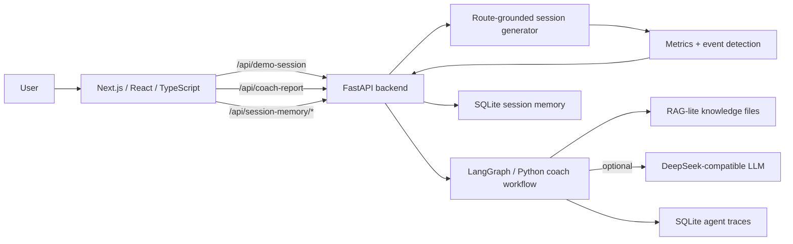
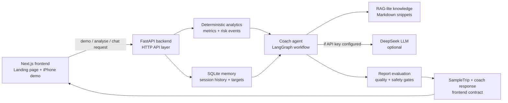
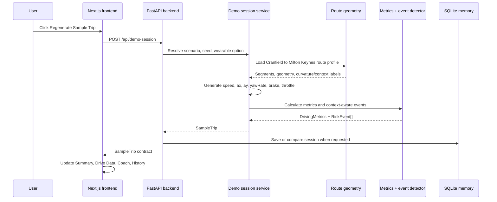
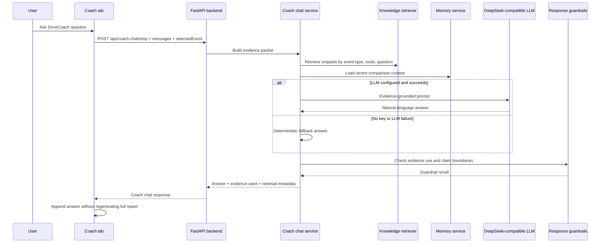
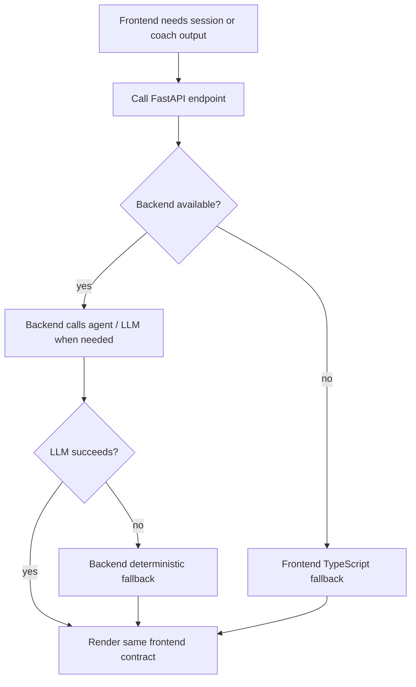
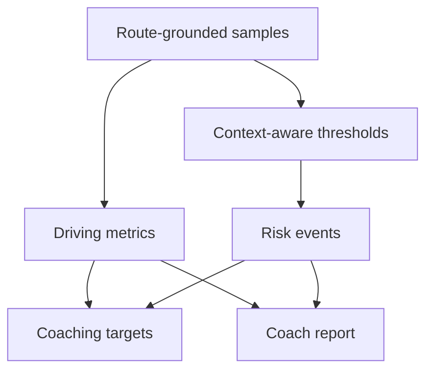

# Technical Design

## Purpose

This document describes the current technical architecture for Human-Centred AI Driving Coach. It focuses on how the Next.js frontend, FastAPI backend, deterministic analytics, AI coach workflow, RAG-lite knowledge, evaluation, and SQLite memory fit together.

The system is designed as a local interactive MVP, not a production deployment.

## Design Goals

- Keep the frontend product demo responsive and understandable.
- Keep deterministic analytics separate from AI language generation.
- Use one shared `SampleTrip` contract between frontend and backend.
- Support API-key-free local operation.
- Make the agent workflow observable and testable.
- Prepare the codebase for real telemetry ingestion without adding upload UI yet.

## High-Level Architecture



### System Chain

This diagram shows the core product path from frontend interaction to backend analysis, agent reasoning, knowledge retrieval, and memory.



Key principle:

- Analytics produce evidence first.
- The agent explains and structures the evidence.
- Knowledge and memory enrich the answer.
- Evaluation gates check whether the answer is specific, measurable, route-aware, and bounded.

### Demo Session Generation Flow

The demo session flow is designed to show the product without requiring CSV upload.



### Coach Chat Flow

Coach chat is grounded in the current trip, optional selected event, retrieved knowledge, and recent session memory.



### Fallback Flow

The product is intentionally resilient in local demos. Backend and LLM failures should degrade to deterministic local behaviour rather than blocking the product story.



Fallback rules:

- The UI should keep the same `SampleTrip` and coach-response contract.
- LLM failure should not remove deterministic metrics, events, targets, or evidence.
- Frontend fallback exists for demo resilience, not as the long-term production architecture.

## Runtime Components

| Component | Path | Responsibility |
| --- | --- | --- |
| Next.js app | `src/app/page.tsx` | Landing page, demo controls, product overview |
| Phone demo | `src/components/PhoneDemo.tsx` | iPhone-style tab container |
| Summary tab | `src/components/SummaryTab.tsx` | Route summary and main opportunity |
| Drive Data tab | `src/components/DriveDataTab.tsx` | Telemetry charts, event details, optional wearable context |
| Coach tab | `src/components/CoachTab.tsx` | AI summary, evidence, next target, chat, trust details |
| History tab | `src/components/HistoryTab.tsx` | Score trend and memory-aware comparison |
| API client | `src/lib/apiClient.ts` | Frontend API calls and fallback integration |
| Backend app | `backend/main.py` | FastAPI route definitions |
| Demo session service | `backend/services/demo_session_service.py` | Route-grounded generation, metrics, context-aware events |
| Ingestion service | `backend/ingestion/session_ingestion_service.py` | Telemetry JSON, CSV path, and route simulation input |
| Agent workflow | `backend/agent/coach_workflow.py` | Coach report node logic |
| LangGraph graph | `backend/agent/langgraph_workflow.py` | Conditional workflow orchestration |
| Knowledge retriever | `backend/agent/knowledge.py` | RAG-lite snippet parsing and retrieval |
| Memory service | `backend/services/session_memory_service.py` | SQLite storage and previous-session comparison |
| Evaluation | `backend/evaluation/` | Report, knowledge, and trace evaluation |

## Data Contract

The frontend and backend exchange a `SampleTrip` object.

Core shape:

```ts
type SampleTrip = {
  id: string;
  title: string;
  createdAt: string;
  provenance?: {
    dataSource: "route_grounded_synthetic" | "telemetry_json" | "csv_path" | string;
    routeSource?: string;
    seed?: number;
    notRealDriverData?: boolean;
    assumptions?: string[];
    vehicleCsvPath?: string;
  };
  route: RoutePreset;
  samples: TripSample[];
  events: RiskEvent[];
  metrics: DrivingMetrics;
};
```

This contract is intentionally frontend-friendly:

- `samples` drive Recharts visualisations.
- `events` drive map markers and event cards.
- `metrics` drive summary scorecards and coach targets.
- `route` drives route map and route-context explanations.
- `provenance` makes synthetic vs real-data assumptions explicit.

## Backend API

| Method | Endpoint | Purpose |
| --- | --- | --- |
| GET | `/health` | Service health check |
| GET | `/api/scenarios` | List fixed and generated demo scenarios |
| POST | `/api/demo-session` | Generate route-grounded demo `SampleTrip` |
| POST | `/api/analyse-session` | Analyse telemetry JSON, CSV path, or route simulation input |
| POST | `/api/coach-report` | Run coach report workflow |
| POST | `/api/coach-chat` | Ask follow-up questions grounded in trip and event evidence |
| POST | `/api/coaching-targets` | Generate measurable next-drive targets |
| POST | `/api/target-completion` | Check previous target completion and active next focus |
| POST | `/api/memory-aware-coaching` | Generate previous-drive comparison summary |
| GET | `/api/agent-traces/recent` | Inspect compact agent traces |
| GET | `/api/knowledge/evaluation` | Evaluate local knowledge base |
| GET | `/api/session-memory/recent` | List recent saved sessions |
| POST | `/api/session-memory/save` | Save current session |
| POST | `/api/session-memory/compare` | Compare current session to previous session and optionally save |

## Session Generation

The current demo generates a Cranfield University to Milton Keynes Midsummer Place trip.

Generation modes:

- fixed ground-truth scenarios
- seeded random agent-generated demo scenario
- route simulation through `/api/analyse-session`
- frontend TypeScript fallback if backend is unavailable

Generated vehicle signals:

- timestamp
- speed
- longitudinal acceleration `ax`
- lateral acceleration `ay`
- yaw rate
- steering angle
- brake
- throttle
- road context
- segment name
- route progress
- optional heart rate

## Analysis Pipeline



Metrics and events are calculated before the agent runs. The LLM is not responsible for inventing risk events or scores.

## Frontend Fallback Strategy

The frontend first calls FastAPI. If the backend is unavailable:

- `generateSampleTrip` creates a local sample trip.
- `generateMockCoachReport` creates a deterministic local report.
- local fallback functions provide targets, memory, and target completion.

This keeps the demo usable in presentation contexts even when the backend is not running.

## Persistence

| Store | File | Purpose |
| --- | --- | --- |
| Session memory | `data/session_memory.sqlite` | Recent session comparison and score trend |
| Agent observability | `data/agent_observability.sqlite` | Compact coach report traces and evaluation results |

The databases are local development artifacts and should remain ignored by git.

## LLM Integration

The backend uses an OpenAI-compatible client to call DeepSeek when configured.

Environment variables:

```powershell
DEEPSEEK_API_KEY
DEEPSEEK_BASE_URL
DEEPSEEK_MODEL
DEEPSEEK_REASONING_EFFORT
DEEPSEEK_THINKING_ENABLED
```

If the LLM call fails, the system falls back to deterministic report generation and keeps the same response schema.

## Testing and Verification

Current verification commands:

```bash
python -m pytest -q -p no:anyio --basetemp=.pytest_tmp
npm run typecheck
npm run lint
npm run build
```

Key test coverage:

- health and demo-session endpoints
- stable ground-truth scenarios
- context-aware event evidence fields
- coach report workflow
- coach chat endpoint
- coaching targets
- target completion
- memory-aware coaching
- knowledge evaluation
- session memory comparison

## Technical Constraints

- No production auth or database service yet.
- Route map is a stylised product SVG, not a live map API.
- Synthetic route data is route-grounded but not real driver data.
- Context-aware thresholds are transparent demo thresholds, not validated fleet calibration.
- LLM output is constrained by report schema and evaluation but remains non-deterministic when the API is enabled.

## Future Technical Work

- Replace cached route geometry with OSRM / OSMnx route fetching and caching.
- Add richer ingestion for CAN, CARLA, ROS bag exports, and batch sessions.
- Add a vector-backed RAG layer only after knowledge evaluation remains stable.
- Separate user-facing and developer-facing modes.
- Add CI checks for Python, TypeScript, knowledge evaluation, and agent report quality.
- Add deployment architecture when the local prototype stabilises.
