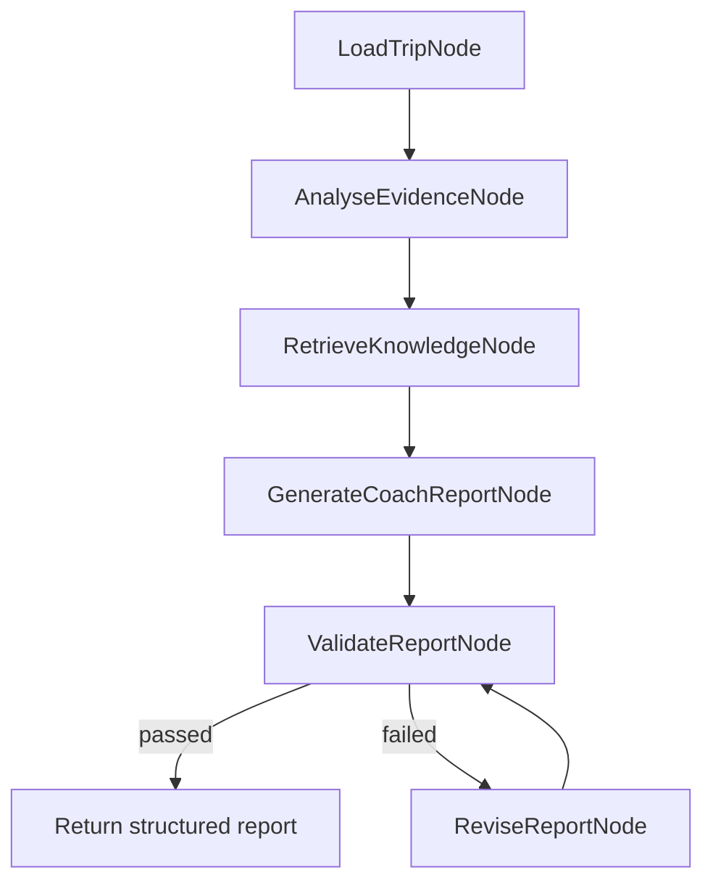

# Agent 工作流设计

## 1. Agent 边界

DriveCoach AI 的 Agent 不负责计算 metrics，也不负责创造 Risk Events。它的职责是：

- 读取 deterministic evidence
- 检索 RAG-lite knowledge
- 解释 route context
- 生成自然语言 coaching summary
- 回答用户追问
- 输出可衡量 next-drive target
- 通过 evaluation 和 revision 控制质量

Agent 不允许：

- 诊断压力、疲劳或健康状态
- 把 synthetic data 说成真实驾驶数据
- 把 thresholds 说成通用 safety limits
- 编造没有证据支持的事件或指标

## 2. CoachAgentState

概念上，Agent state 包含：

```text
trip
route_context
metrics
events
evidence_summary
retrieved_knowledge
memory_context
report
report_validation
revision_count
workflow_nodes
```

这个 state 让未来可以继续加入 vector RAG、真实 telemetry、ADAS-on/off comparison 或 human review。

## 3. LangGraph-ready workflow



## 4. 节点职责

| Node | 作用 |
| --- | --- |
| LoadTripNode | 读取 trip、route、metrics、events |
| AnalyseEvidenceNode | 找到主要 behavioural pattern 和关键证据 |
| RetrieveKnowledgeNode | 根据 event type、route context 和 question 检索 RAG-lite snippets |
| GenerateCoachReportNode | 使用 DeepSeek 或 deterministic fallback 生成 report |
| ValidateReportNode | 检查字段、证据、路线相关性和过度声明 |
| ReviseReportNode | 修复缺失字段或不安全语言 |

## 5. Coach report contract

```json
{
  "summary": "...",
  "structuredSummary": {
    "overallAssessment": "...",
    "mainBehaviouralPattern": "...",
    "routeContextExplanation": "...",
    "whyItMatters": "...",
    "nextDriveFocus": []
  },
  "keyFindings": [],
  "evidenceUsed": [],
  "retrievedKnowledge": [],
  "evaluation": {}
}
```

## 6. Coach chat contract

输入：

```json
{
  "trip": {},
  "messages": [{ "role": "user", "content": "Why was this event important?" }],
  "selectedEvent": {}
}
```

输出：

```json
{
  "answer": "...",
  "evidenceUsed": [],
  "coachingActions": [],
  "confidence": "medium",
  "safetyNotes": [],
  "followUpQuestions": []
}
```

## 7. RAG-lite

当前知识库是 Markdown 文件，位于：

```text
backend/knowledge/
```

每个 snippet 包含：

- id
- title
- eventTypes
- keywords
- source
- confidence
- doSay
- doNotSay
- body

返回时会包含 `matchedBy`、`whyUsed` 和 `retrievalMode`，让 retrieval 可解释。

## 8. Observability

每次 `/api/coach-report` 会记录 compact trace，包括：

- session id
- route
- metrics summary
- event summary
- workflow nodes
- retrieved knowledge
- evaluation results

这让 Agent 不只是“能回答”，而是可观察、可调试、可评估。
