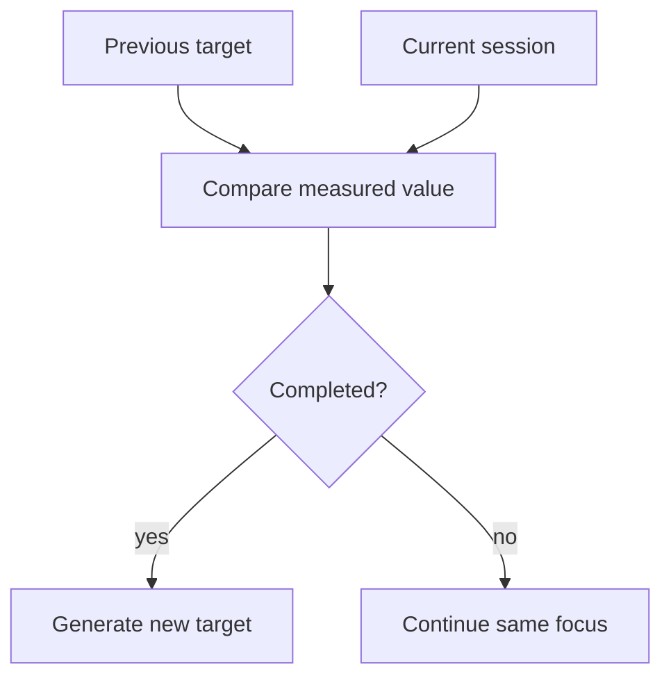

# 指标与评估

## 1. 目标

DriveCoach AI 有两层评估：

1. Driving analysis evaluation  
   根据 telemetry 和 route context 判断这次驾驶发生了什么。

2. Agent quality evaluation  
   判断 AI coach 的建议是否具体、可执行、证据充分、路线相关，并且没有过度声明。

这两层必须分开。LLM 只解释 evidence，不创造 metrics 或 Risk Events。

## 2. 核心 telemetry

| 字段 | 单位 | 作用 |
| --- | --- | --- |
| timestamp | seconds | 时间轴 |
| speed | m/s | 速度 profile |
| ax | m/s² | 纵向加速度，反映制动和加速 |
| ay | m/s² | 横向加速度，反映过弯和横向需求 |
| yawRate | rad/s | 横摆变化，作为转向平顺性的 proxy |

可选字段包括 steeringAngle、brake、throttle、roadContext、segmentName、targetSpeed、heartRate 等。

## 3. Driving metrics

| Metric | 计算方式 | 解释 |
| --- | --- | --- |
| meanSpeed | mean(speed) | 平均速度 |
| maxSpeed | max(speed) | 最高速度 |
| speedStd | std(speed) | 速度波动 |
| meanAbsAx | mean(abs(ax)) | 典型纵向控制强度 |
| maxAbsAx | max(abs(ax)) | 最大制动或加速峰值 |
| meanAbsAy | mean(abs(ay)) | 典型横向需求 |
| maxAbsAy | max(abs(ay)) | 最大横向需求 |
| accelerationRms | sqrt(mean(ax²)) | 纵向运动能量 |
| yawRateRms | sqrt(mean(yawRate²)) | 横摆变化需求 |

所有 score 都 clamp 到 0-100，分数越高代表越平顺或越稳定。

## 4. Risk Event rules

基础规则：

| Event | Rule |
| --- | --- |
| harsh_braking | ax < -3.0 |
| harsh_acceleration | ax > 2.5 |
| high_lateral_acceleration | abs(ay) > 2.0 |
| sharp_yaw_motion | abs(yawRate) > 0.35 |
| unstable_speed_control | rolling window 内速度波动和加速度符号变化过多 |

扩展 route-aware events：

- late_braking_before_curve
- high_speed_in_curve
- unstable_cornering

## 5. Context-aware thresholds

同样的信号在不同路段意义不同。因此阈值会根据：

- roadContext
- targetSpeed
- curvatureLevel
- trafficComplexity
- expectedLateralDemand
- speed-normalised lateral demand

进行调整。

例如：

- campus / destination：期望低速、平顺控制
- rural straight：允许更稳定巡航，但不鼓励高横向需求
- country curve：重点看入弯速度和横向需求
- junction / urban arrival：重点看速度波动和制动平顺性

## 6. Coaching targets

目标必须可衡量，例如：

```json
{
  "title": "Reduce late or harsh braking",
  "baselineValue": 2,
  "targetValue": 1,
  "unit": "events",
  "measurement": "Count braking-related events and review peak longitudinal deceleration."
}
```

目标来源必须连接到：

- metric
- Risk Event
- route context
- previous-session comparison

## 7. Target completion loop



## 8. Agent quality evaluation

当前 evaluation 不只检查格式，还会评估建议质量：

| 维度 | 检查内容 |
| --- | --- |
| suggestion specificity | 建议是否具体，不是泛泛而谈 |
| target measurability | 目标是否能在下一次 session 中衡量 |
| route-context relevance | 是否提到路线、路段或 context |
| no-overclaim score | 是否避免医疗、疲劳、安全认证等过度声明 |
| coach usefulness score | 综合判断建议是否有用 |

## 9. 校准计划

当前 thresholds 是 MVP heuristic。未来需要：

1. 收集真实或仿真 telemetry。
2. 让 human reviewer 标注 event type、start/end、severity 和 confidence。
3. 计算 precision、recall、F1。
4. 按 road context、vehicle type、speed range 和 curvature 更新阈值。
5. 对 ADAS-on/off 对比控制 route、traffic、weather、vehicle 和 driver。

## 10. 引用依据

当前设计参考：

- NHTSA Driver Assistance Technologies: https://www.nhtsa.gov/vehicle-safety/driver-assistance-technologies
- OSRM route API: https://project-osrm.org/docs/v5.24.0/api/
- OSMnx paper: https://arxiv.org/abs/1611.01890
- HRV Task Force standard: https://www.escardio.org/static_file/Escardio/Guidelines/Scientific-Statements/guidelines-Heart-Rate-Variability-FT-1996.pdf
- Ragas metrics: https://docs.ragas.io/en/stable/concepts/metrics/available_metrics/

这些资料用于支撑路线 grounding、车辆动态关系、可选 driver-state context 和 RAG / Agent evaluation 思路。当前阈值仍需用真实或仿真标注数据进一步校准。
