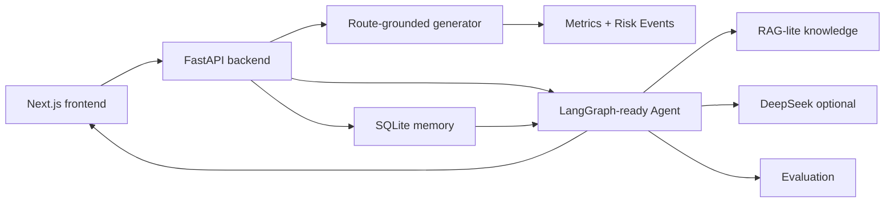
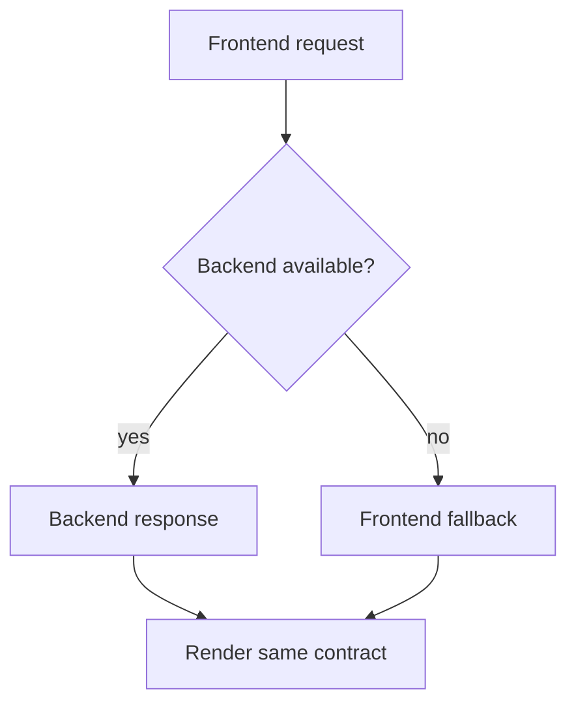

# 技术设计

## 1. 目标

本项目是一个本地交互式 MVP，目标是把 Next.js 前端、FastAPI 后端、deterministic analytics、AI coach workflow、RAG-lite knowledge、SQLite memory 和 evaluation 连接成一个完整产品 demo。

核心原则：

- 前端负责产品体验和信息层级。
- 后端负责 session generation、analysis、agent、memory 和 evaluation。
- `SampleTrip` 是前后端共享 contract。
- LLM 是增强能力，不是系统运行的必要条件。

## 2. 系统架构



## 3. 前端

技术栈：

- Next.js
- React
- TypeScript
- Tailwind CSS
- Recharts

主要组件：

- `PhoneDemo`
- `SummaryTab`
- `DriveDataTab`
- `CoachTab`
- `HistoryTab`
- `RouteMapCard`
- `TripChart`
- `DocumentationSections`

前端保留 TypeScript fallback，确保后端不可用时 demo 仍能展示。

## 4. 后端

技术栈：

- Python
- FastAPI
- SQLite
- optional DeepSeek API
- LangGraph-compatible workflow

主要模块：

| 模块 | 作用 |
| --- | --- |
| `backend/main.py` | API 路由 |
| `backend/services/demo_session_service.py` | route-grounded session generation |
| `backend/ingestion/` | telemetry JSON / CSV path / route simulation |
| `backend/agent/` | coach workflow、chat、knowledge retrieval |
| `backend/evaluation/` | report / knowledge / trace evaluation |
| `backend/services/session_memory_service.py` | SQLite memory |

## 5. 核心 API

| Endpoint | 作用 |
| --- | --- |
| `GET /health` | 健康检查 |
| `POST /api/demo-session` | 生成示例 SampleTrip |
| `POST /api/analyse-session` | 分析 telemetry JSON / CSV path / route simulation |
| `POST /api/coach-report` | 生成 coach report |
| `POST /api/coach-chat` | Ask DriveCoach |
| `POST /api/coaching-targets` | 生成下一次目标 |
| `POST /api/target-completion` | 判断上次目标是否完成 |
| `POST /api/memory-aware-coaching` | 生成历史对比 |

## 6. 数据 contract

核心对象是 `SampleTrip`：

```ts
type SampleTrip = {
  id: string;
  title: string;
  createdAt: string;
  provenance?: Record<string, unknown>;
  route: RoutePreset;
  samples: TripSample[];
  events: RiskEvent[];
  metrics: DrivingMetrics;
};
```

`samples` 驱动图表，`events` 驱动地图 marker 和 event cards，`metrics` 驱动评分与目标，`route` 驱动路线解释，`provenance` 标记 synthetic / real / route simulation 来源。

## 7. Fallback 策略



原则：

- 后端不可用时，前端仍能生成 sample trip。
- LLM 不可用时，后端返回 deterministic fallback。
- UI 使用同一个 contract，不因为 fallback 改变结构。

## 8. 当前限制

- 路线地图是产品化 mock，不是 live map API。
- 当前 session 是 route-grounded synthetic data。
- context-aware thresholds 仍是 heuristic，需要真实或仿真标注数据校准。
- LLM 输出受 schema 和 evaluation 约束，但启用 API 后仍可能有非确定性。
